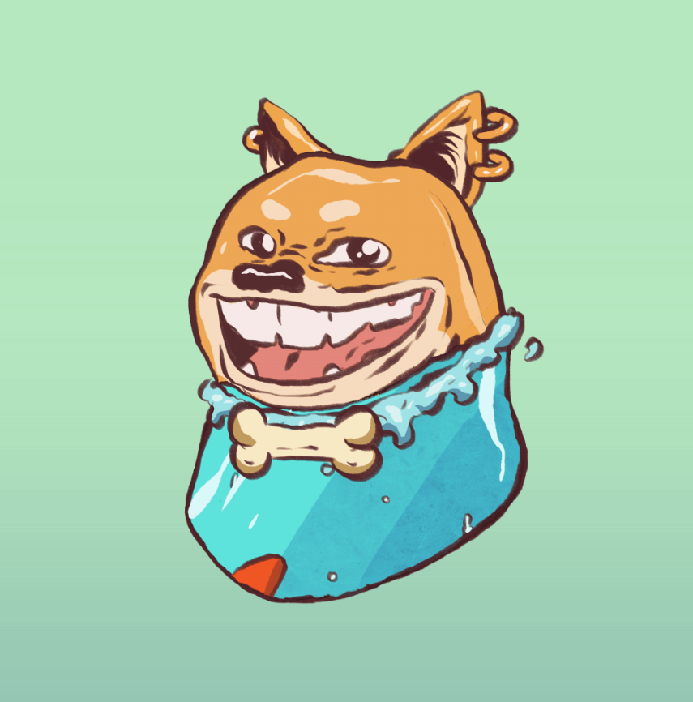

# Elite Doge Club Official

朋友们，您知道关于 Elite Doge Club (EDC) 的这些事实吗……又名人民的 NFT？拥有 NFT 历史上的一刻：Bump Doge - 第一个拥有 100,000 个独特变体的头像头像。由朱利安·德拉贡（Julien Deragon）手工制作，他曾在《权力的游戏》和《怪奇物语》等热门电视节目中工作。LED & 由 Maximilian Lekhtman 创立 - 他经营着世界上最成功的数字广告公司之一。首次购买 NFT 的人：“我喜欢 Elite Doge Club 系列，因为它比大多数 NFTS 更便宜、更安全、更具包容性”。资深收藏家：“EDC 是一个明显的赢家，因为我可以用不到 1 个过度炒作的 png 铸造 200 个质量 NFTS！”定价和天然气：“它几乎比大多数铸币厂便宜 10 倍，只需 0.01 ETH！而且铸币越多，天然气/NFT 就越少！”双重作为薄荷通行证：没错，如果 GOT 动画师、0.01 ETH 的价格和良好的领导力还不够，那么这个系列中的每个 NFT 也是即将到来的 IRL 活动的薄荷通行证、折扣、提前获得未来的薄荷更多！

