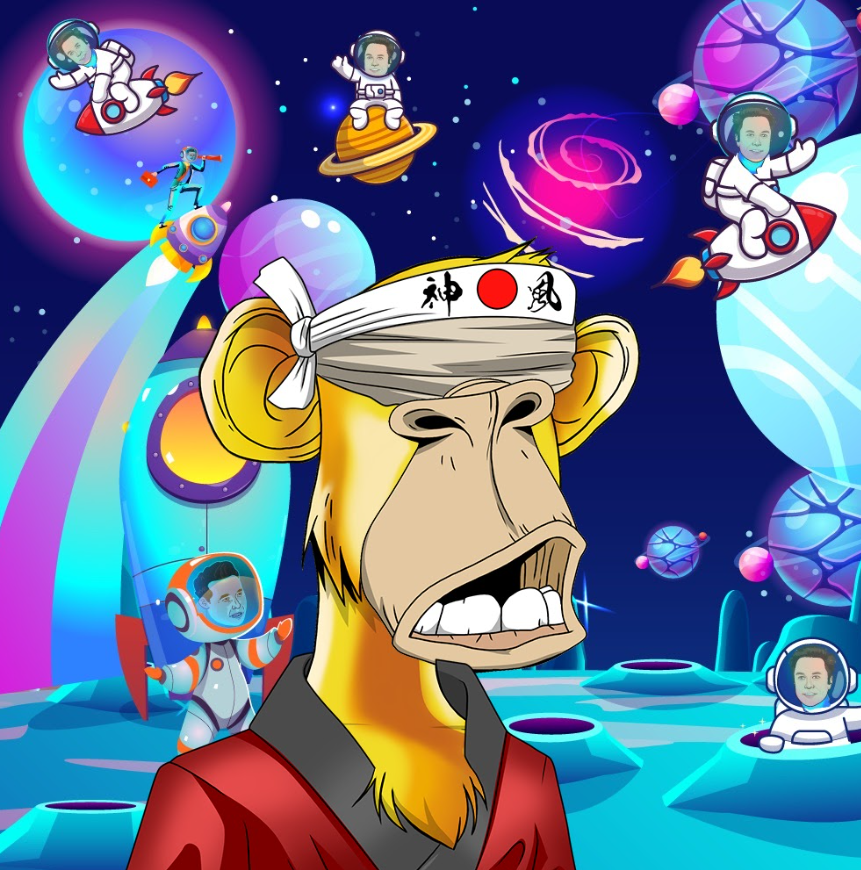

# ElonApes

其意图始终是一个社区驱动的 NFT 项目，其中包含 4444 个 Elon Apes 手绘，不匹配任何以太坊 BAYC 特征组合。Elon Apes 不隶属于 Yuga Labs。其意图始终是一个社区驱动的 NFT 项目，其中包含 4444 个 Elon Apes 手绘，不匹配任何以太坊 BAYC 特征组合。Elon Apes 不隶属于 Yuga Labs。埃隆猿来了！我们将一起接管空间并创造历史前 1000 个 NFT 是免费的！其他 3444 的价格为 0.0059 ETH在 1 小时内，我们将推出 Elon Apes 薄荷糖！! 提醒：前 1000 个 NFT 可以免费铸造，!! 其他 3444 个可以以 0.0059 ETH 的价格铸造 50% 的版税将用于社区和改进项目！

