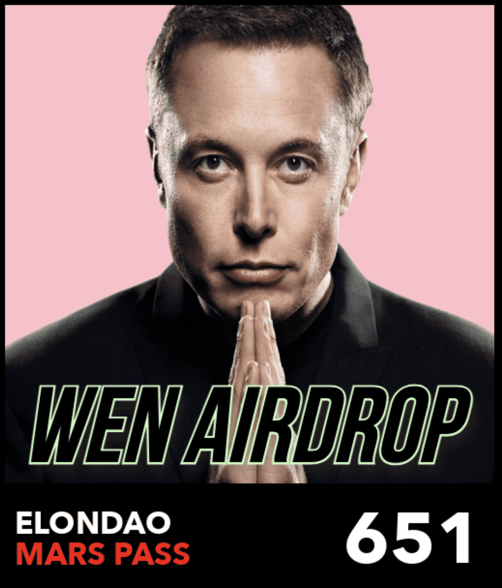

# Elon DAO

**Elon DAO 统计数据**

创建于 8 个月前，969代币供应，6.94% 费用

过去 7 天没有出售 Elon DAO。

ElonDAO 是一项旨在破坏太空经济的银河草根运动。ElonDAO 为人民服务，为人民服务。我们的核心价值观是：S3XY、智慧、火星和积极性。

Elon DAO NFT - 常见问题（FAQ）
▶ 什么是 Elon DAO？
Elon DAO 是一个 NFT（不可替代令牌）集合。存储在区块链上的数字艺术品集合。
▶ 有多少 Elon DAO 代币？
总共有 969 个 Elon DAO NFT。目前 517 位所有者的钱包中至少有一个 Elon DAO NTF。
▶ 最昂贵的 Elon DAO 销售是什么？
售出的最昂贵的 Elon DAO NFT 是 ElonDAO Pass #341。它于 2022-06-07（3 个月前）以 18.1 美元的价格售出。
▶ 最近卖出了多少 Elon DAO？
过去 30 天内售出了 4 个 Elon DAO NFT。

