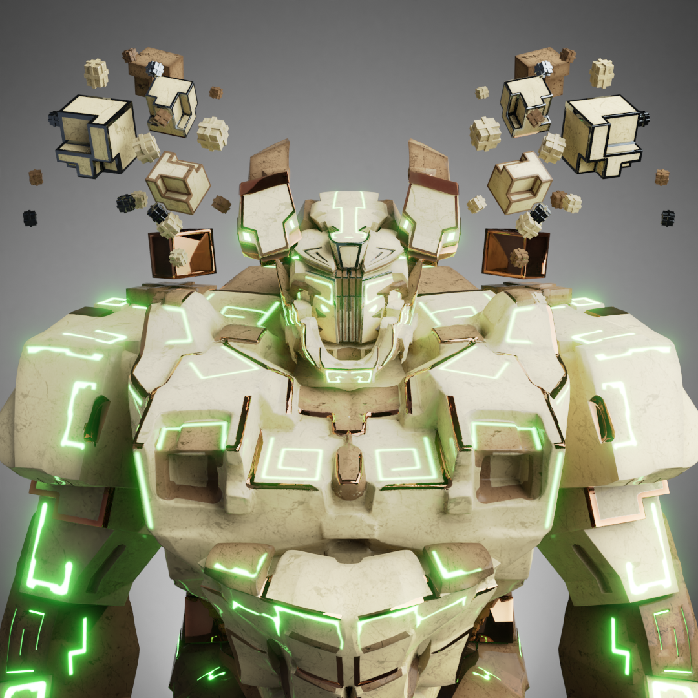

# EMETH OFFICIAL PROJECT

EMΞTH 是在以太坊区块链上调用的 8,888 个独特魔像的集合。魔像在史诗般的战斗中为保护他们的社区而战，这将被世世代代铭记。Golems 和其他主要 NFT 社区之间将定期组织战斗。‍ 每场战斗都有机会收集与其他社区合作制作的记忆和独特的 NFT。这是一个新概念，我们称之为：玩收集Golems 和其他主要 NFT 社区之间将定期组织战斗。‍ 每场战斗都有机会收集与其他社区合作制作的记忆和独特的 NFT。

