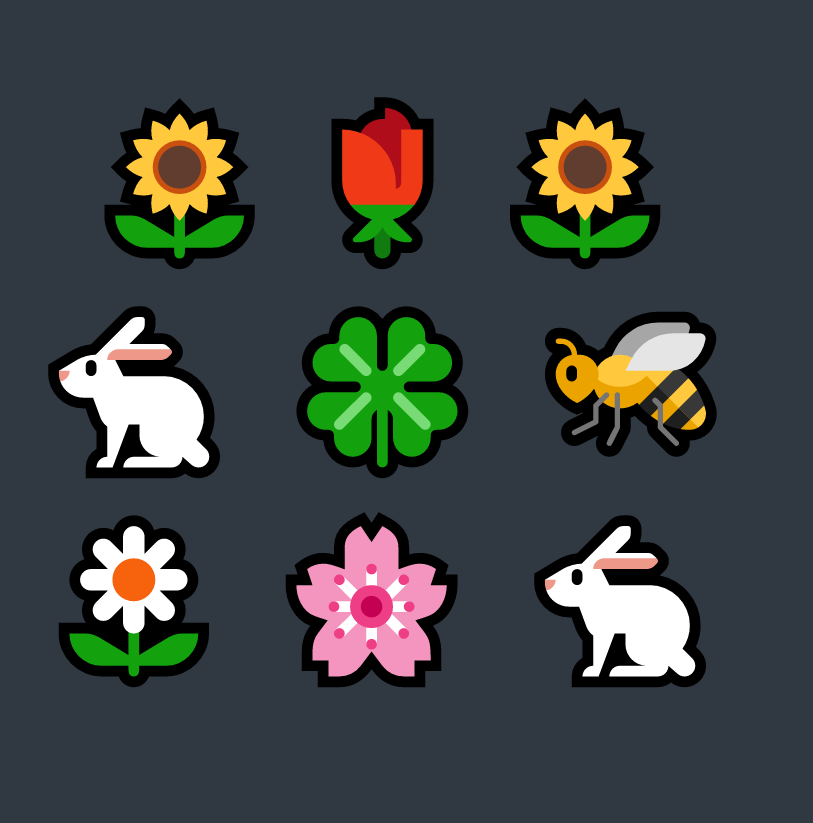

# Emoji Garden

4420 个随机生成的花园供您拥有和分享。每一个都完全存储在链上……没有 JPG，没有 IPFS，只有纯表情符号原语，你可以使用任何你想要的方式。每个 Emoji Garden 都是 Millyverse 中的一个创世地块，让您拥有[MidwitMilhouse]未来项目的权利。Emoji Garden 是一个链上 NFT，具有随机生成的各种表情符号。没有文件，没有 IPFS，你可以在以太坊上种植美丽的🌷。4,420 个花园可用于每个 0.01 ETH 的申领。要铸币，请使用下面的按钮连接您的 Web3 提供商。每个 Emoji Garden 都供您使用和建造。未来的 NFT 项目可能会使用 Emoji Garden 作为生成艺术、游戏等的基础。Emoji Garden 的合约已经过仔细测试，但请自行承担风险。如果您想在 OpenSea 等二级市场铸造后检查您的花园，请给 OpenSea 一点时间，让花园及其元数据出现。

