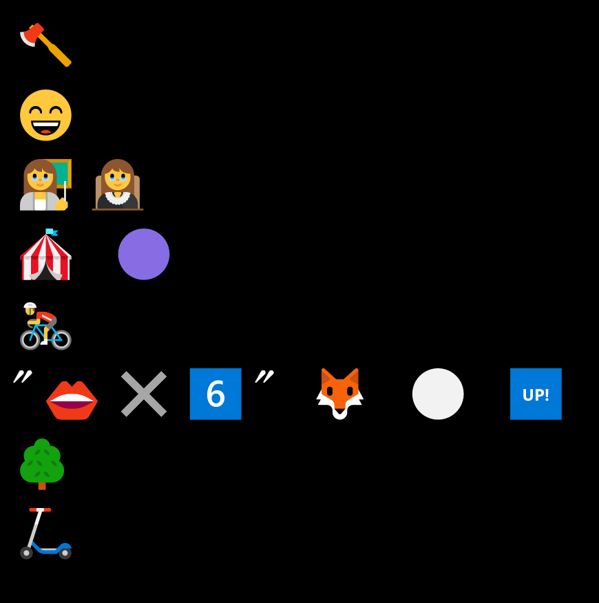

# Emoji Loot

表情符号战利品是随机生成并存储在链上的冒险家装备。故意省略统计信息、图像和其他功能以供其他人解释。随意以任何你想要的方式使用 Emoji Loot。

社区
由社区运营的空间供供 Emoji Loot，分享新闻和共同建设：

Emoji Loot Community Discord — 对于 Emoji Loot 和衍生品的所有内容（注意：高翻译）

Emoji Loot Talk (Forum) — Emoji Loot 对一个建设者进行讨论的地方，供和社区使用

开发者工具
Emoji Loot 社区制造的聚合资源：

Emoji Loot Rarity — @AustinGreen 的 Emoji Loot 属性和稀有度表

dhof-loot —所有包包、物品出现次数、包包稀有度和图片，来自@anish-agnihotri 和@ktasbas

Emoji Loot 子图—Emoji Loot 包、@moshahruz 和转移子图

loot-sdk — TypeScript 包装器，用于通过@shahruz 掠夺子图

0xinventory.app — @scotato 的表情符号战利品包和物品稀有浏览器

Robes.Market —包含神圣长袍的袋子的地板跟踪器@worm#6888

字符生成器 —— 从战利品袋中生成字符

loot- rarity — @bpierre 的战利品 (TypeScript SDK) 的稀有颜色

loot-rarity-bookmarklet — 向 OpenSea 添加稀有有颜色的书

Emoji LootComponents.sol —轻松 Emoji Loot 属性与属性的实用程序签约使用

