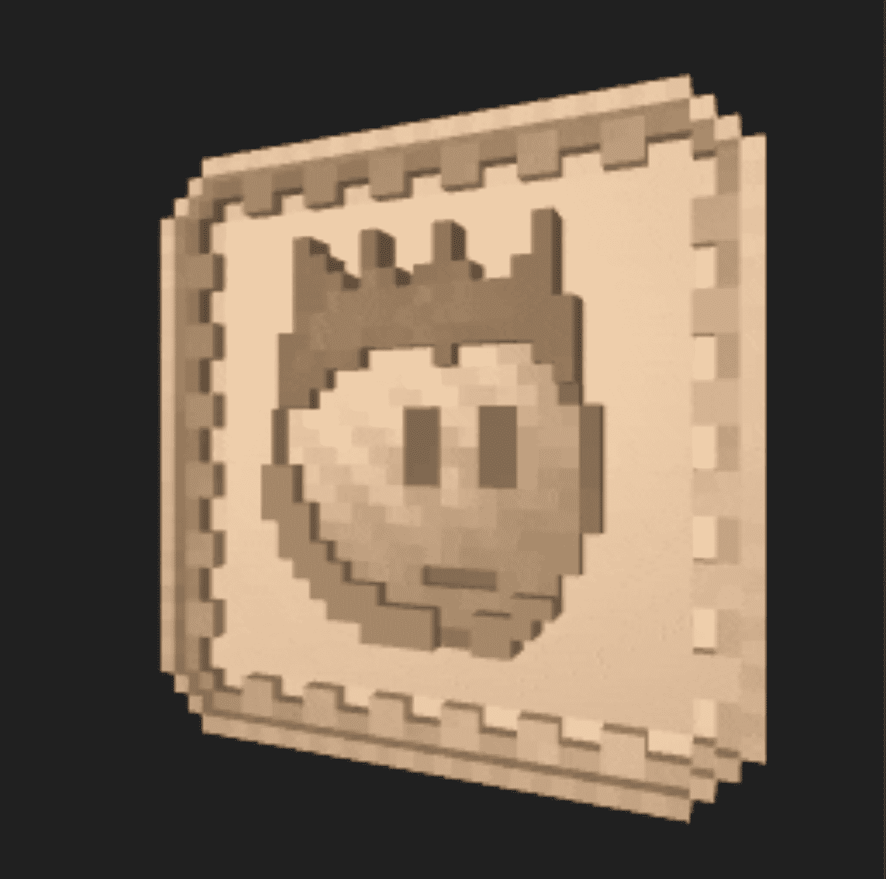

# EmojiCoins

**EmojiCoins 统计**

创建于 6 个月前，2,000 代币供应，2.5% 费用

过去 7 天没有出售 EmojiCoin。

包含 10,000 种独特的硬币设计，带有不可重复的表情符号。[在https://emojicoins.eth.link]
上收集/stake/mint 等

EmojiCoins NFT - 常见问题（FAQ）

▶ 什么是 EmojiCoins？

EmojiCoins 是一个 NFT（不可替代令牌）集合。存储在区块链上的数字艺术品集合。

▶ 有多少个 EmojiCoins 代币？

总共有 2,000 个 EmojiCoins NFT。目前 242 位所有者的钱包中至少有一个 EmojiCoins NTF。

▶ 最近卖出了多少 EmojiCoin？

过去 30 天内共售出 0 个 EmojiCoins NFT。

