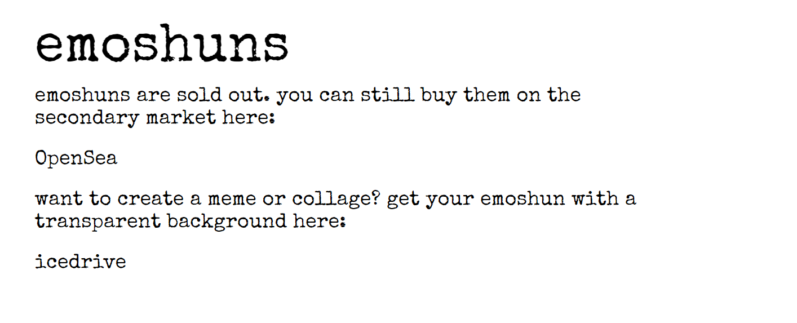

# emoshuns

有些是相关的，有些则难以理解。就像现实生活一样。emoshuns NFT - 常见问题（FAQ）
▶ 什么是emoshuns？
emoshuns 是一个 NFT（非同质代币）集合。存储在区块链上的数字收藏品集合。
▶ 有多少个 emoshuns 代币？
88个表情有5,000个NFT。目前有1个emo1个的钱包中至少有一个NT
▶最近有多少个emoshun？
过去 30 个卖出 0 个 emo NFT。

moshuns 已售罄。您仍然可以在二级市场上购买它们：

[外海]

想要创建模因或拼贴画？在此处获取具有透明背景的 emoshun：

