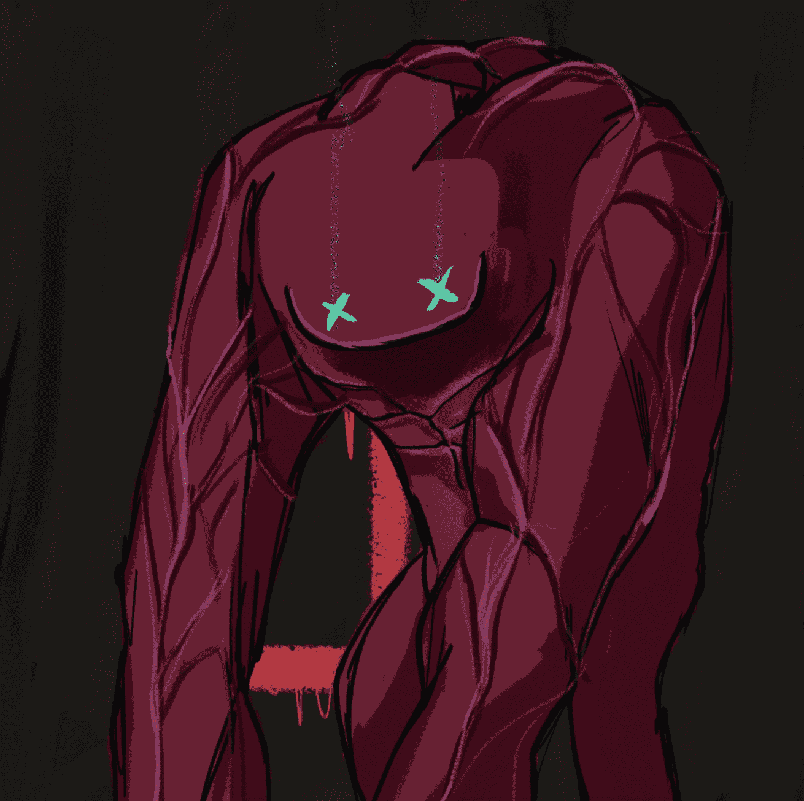

# Enderverse

**末影宇宙**

安德宇宙，又称安德的游戏系列、安德的游戏传奇、安德的游戏宇宙或安德的宇宙，是由奥森·斯科特·卡德授权或创作的一系列科幻作品。

该系列以“安德的游戏”开始，这是一篇短篇小说，发表在 1977 年 8 月的《模拟科幻与事实》杂志上。由于故事的巨大成功，卡德后来在8 年后将 其扩展为同名小说。

目前，该系列由18部小说、16部短篇小说、2部短篇小说集、1部散文集、13部连环漫画和连环漫画、 1部漫画、1部电影、1部参考书和1部有声改编作品组成。

