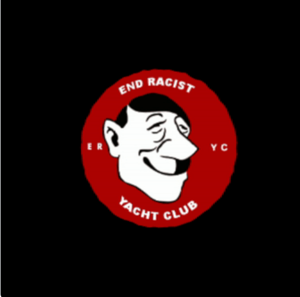

# End Racist Yacht Club

▶ 什么是 End Racist 游艇俱乐部？
End Racist Yacht Club 是一个 NFT（不可替代代币）系列。存储在区块链上的数字艺术品集合。
▶ 存在多少 End Racist Yacht Club 代币？
总共有 4,048 个 End Racist Yacht Club NFT。目前，419 位船主的钱包中至少有一个 End Racist Yacht Club NTF。
▶ End Racist Yacht Club 最昂贵的拍卖会是什么？
售出的最昂贵的 End Racist Yacht Club NFT 是 End Racist Yacht Club。它于 2022-07-02（大约 2 个月前）以 3.3 美元的价格售出。
▶ 最近售出了多少 End Racist 游艇俱乐部？
过去 30 天内售出了 94 个 End Racist Yacht Club NFT。
▶ End Racist 游艇俱乐部的费用是多少？
在过去 30 天里，End Racist Yacht Club NFT 最便宜的销售额低于 1 美元，最高销售额超过 2 美元。在过去 30 天内，End Racist Yacht Club NFT 的中位价格为 1 美元。
▶ 有哪些流行的 End Racist Yacht Club 替代品？
许多拥有 End Racist Yacht Club NFT 的用户还拥有 Euclidean Nodes、 Punked、 Genesis of Angels和 Yuki Chaos。

