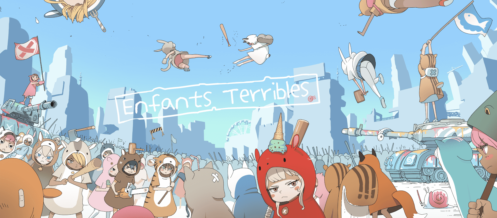

# EnfantsTerribles

**可怕的儿童**

*more_horiz*

经过 ：[TeamEnfantsTerribles]

Enfants Terribles 是一个 PFP 集合的可爱和叛逆的孩子。我们希望通过我们儿童外表背后的艺术和故事来娱乐 NFT 社区！我们迫不及待地想让您加入我们的 web3 社区。

常问问题
Enfants Terribles 的总供应量是多少？
open accordion button
7,777（团队 777）
实用程序或路线图是什么？
open accordion button
Enfants Terribles 没有路线图！他们没有计划！婴儿出生和长大，可以做任何他们想做的事。
薄荷什么时候出？
open accordion button
我们将于 2022 年 7 月 14 日进行铸币。WL
铸币厂将于 UTC 时间 13:30 进行，而公共铸币厂将在 UTC 时间 14:00 进行。
多少钱？
open accordion button
1 免费铸币厂，然后 0.0084 ETH/每个。
每笔交易我可以铸造多少个 Enfant？
open accordion button
每笔交易最多 3 个。
该集合是否有 CC0 许可证？
open accordion button
Enfants Terribles 的版权属于 [Enfants Terribles NFT] 团队。
ETN战队必须拥有版权，为了《惊魂记》的成长。
只有 Enfants Terribles 持有者才有权在未获得创作者许可的情况下使用 NFT 进行商业开发。
其他方应向团队询问其他用途。

