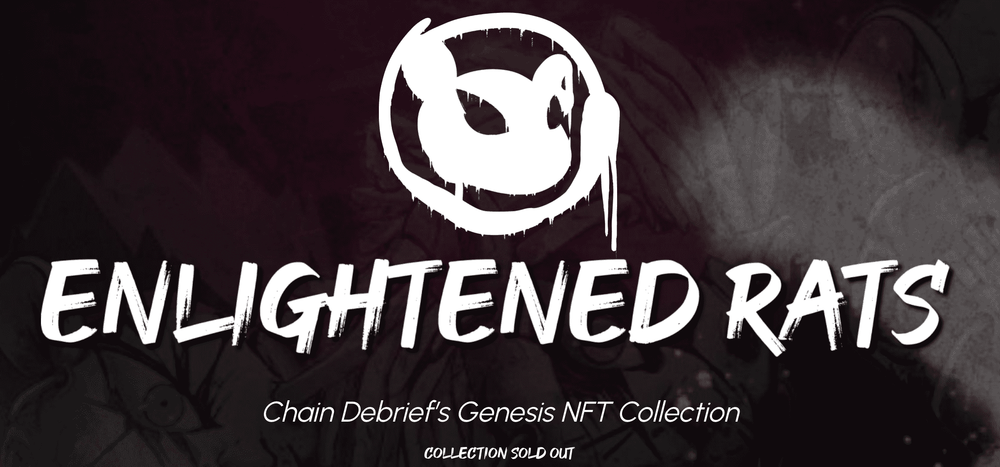

# Enlightened Rats

**开明的老鼠**

Enlightened Rats NFT 在过去 7 天内售出 1 次。Enlightened Rats 的总销售额为 133.93 美元。一只 Enlightened Rats NFT 的平均价格为 133.9 美元。有 564 名 Enlightened Rats 所有者，总共拥有 888 个代币。

Enlightened Rats 是 888 个随机生成的数字收藏品的集合，是[Chain Debrief]发布的第一个系列。每个 NFT 都是独一无二的，是信仰的象征。

Enlightened Rats NFT - 常见问题（FAQ）
▶ 什么是开明老鼠？
Enlightened Rats 是一个 NFT（非同质代币）集合。存储在区块链上的数字艺术品集合。
▶ 有多少 Enlightened Rats 代币？
总共有 888 个 Enlightened Rats NFT。目前，564 位所有者的钱包中至少有一个 Enlightened Rats NTF。
▶ 最昂贵的 Enlightened Rats 销售是什么？
出售的最昂贵的 Enlightened Rats NFT 是 Enlightened Rat #562。它于 2022-06-05（3 个月前）以 545.9 美元的价格售出。
▶ 最近卖出了多少只启蒙鼠？
过去 30 天内售出了 6 只 Enlightened Rats NFT。
▶ 什么是流行的 Enlightened Rats 替代品？
许多拥有 Enlightened Rats NFT 的用户还拥有 CryptoBengz、 MetaJam Asia-MetaPass Genesis、 TheWhiskyClub和 WGMI Industries Genesis。

