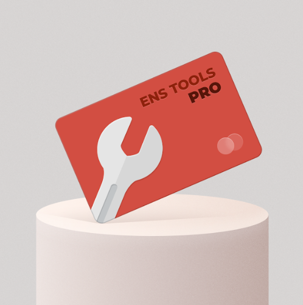

# ENS Tools

什么是 ENS 工具？
ENS 工具是一个 NFT（不可替代令牌）集合。存储在区块链上的数字艺术品集合。
▶ 存在多少个 ENS 工具代币？
总共有 1 个 ENS 工具 NFT。目前 146 位所有者的钱包中至少有一个 ENS 工具 NTF。
▶ 最昂贵的 ENS 工具销售是什么？
最昂贵的 ENS Tools NFT 是 ENS Tools Pro Membership。它于 2022-06-06（3 个月前）以 698.3 美元的价格售出。
▶ 最近卖出了多少 ENS 工具？
过去 30 天内售出了 16 个 ENS 工具 NFT。
▶ ENS 工具的价格是多少？
在过去 30 天里，最便宜的 ENS Tools NFT 销售额低于 358 美元，最高销售额超过 692 美元。过去 30 天 ENS 工具 NFT 的中位价格为 477 美元。
▶ 什么是流行的 ENS 工具替代品？
许多拥有 ENS 工具 NFT 的用户还拥有 WNS：Membership Pass、 Char0、 CryptoTrunks POAP和 EggBois。

