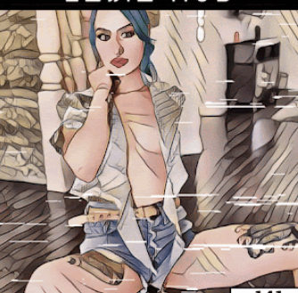

# Ensin Hub Community

▶ 什么是 Ensin Hub 社区？
Ensin Hub 社区是一个 NFT（Non-fungible token）集合。存储在区块链上的数字艺术品集合。
▶ 存在多少 Ensin Hub 社区代币？
总共有 786 个 Ensin Hub 社区 NFT。目前，11 位所有者的钱包中至少有一个 Ensin Hub 社区 NTF。
▶ 最昂贵的 Ensin Hub 社区销售是什么？
出售的最昂贵的 Ensin Hub 社区 NFT 是 Saumlaki #93。它于 2022 年 6 月 21 日（2 个月前）以 32.9 美元的价格售出。
▶ 最近卖出了多少 Ensin Hub 社区？
过去 30 天内售出了 3 个 Ensin Hub 社区 NFT。
▶ 有哪些流行的 Ensin Hub 社区替代方案？
许多拥有 Ensin Hub 社区 NFT 的用户还拥有 NFT 数字艺术、 Buma 收藏、 FEET_FOOT_TOES_SOLES_PIES_P

