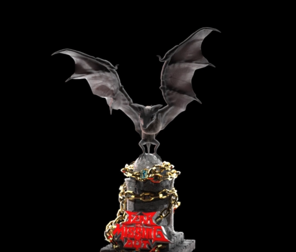

# Enso Trophies

▶ 什么是恩索奖杯？
Enso Trophies 是一个 NFT（非同质代币）集合。存储在区块链上的数字艺术品集合。
▶ 存在多少 Enso Trophies 代币？
总共有 7 个 Enso Trophies NFT。目前，3,620 名所有者的钱包中至少有一个 Enso Trophies NTF。
▶ 最昂贵的 Enso Trophies 拍卖会是什么？
出售的最昂贵的 Enso Trophies NFT 是 Enso Master Coin。它于 2022-07-01（大约 2 个月前）以 123.6 美元的价格售出。
▶ 最近卖出了多少 Enso Trophies？
过去 30 天内售出了 7 个 Enso Trophies NFT。
▶ 什么是流行的 Enso Trophies 替代品？
许多拥有 Enso Trophies NFT 的用户还拥有 Anime Gang: Genesis、 Atlantis World Magical Keys、 H1VE和 Pooly-Supporter。

