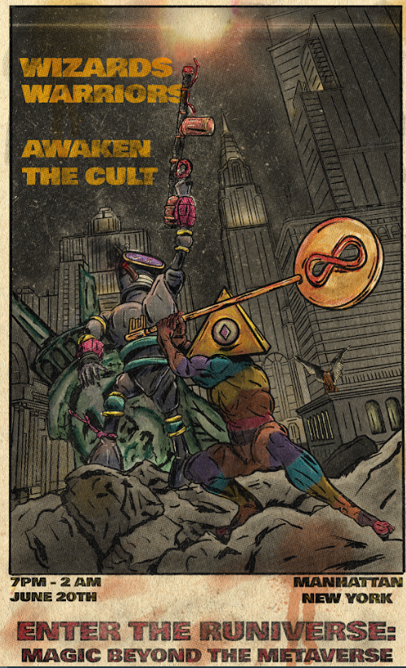

# ENTER THE RUNIVERSE

▶ 什么是 ENTER THE RUNIVERSE？
ENTER THE RUNIVERSE 是一个 NFT（非同质代币）集合。存储在区块链上的数字艺术品集合。
▶ 有多少 ENTER THE RUNIVERSE 代币？
总共有 1 个 ENTER THE RUNIVERSE NFT。目前，30 位所有者的钱包中至少有一个 ENTER THE RUNIVERSE NTF。
▶ ENTER THE RUNIVERSE 最昂贵的促销活动是什么？
最昂贵的 ENTER THE RUNIVERSE NFT 是 MAGIC BEYOND THE METAVERSE。它于 2022-06-18（2 个月前）以 36.2 美元的价格售出。
▶ 最近卖出了多少 ENTER THE RUNIVERSE？
过去 30 天内售出了 20 个 ENTER THE RUNIVERSE NFT。
▶ ENTER THE RUNIVERSE 的费用是多少？
过去 30 天，ENTER THE RUNIVERSE NFT 最便宜的销售额低于 36 美元，最高销售额超过 36 美元。过去 30 天 ENTER THE RUNIVERSE NFT 的中位价格为 36 美元。
▶ 流行的 ENTER THE RUNIVERSE 替代品有哪些？
许多拥有 ENTER THE RUNIVERSE NFT 的用户还拥有 Forgotten Souls、 Wandievents、 CRYPTO TRADER CARDS和 Aura Girls。

