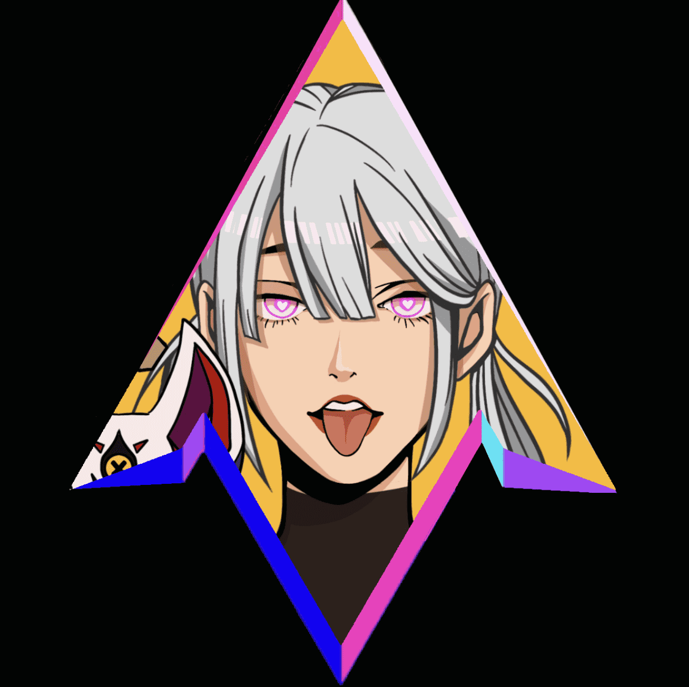

# Enter Shizuka

**进入静香 - 创世纪系列**

未知的腐败实体在元节的阈值中恶化。SHIZUKA 是 1555 个 AI 生成的刺客的集合，并针对腐败进行了实验性战斗功能的优化。他们居住并穿越故障，否则无法进入，以维持秩序和稳定。

Shizuka 是一个艺术和社区驱动的项目。Shizuka 的艺术旨在通过创造力和自我表达来激励社区。它寻求在已建立和实验之间建立对话，推进和适应 NFT 空间不断变化的格局。

通过视觉世界构建和讲故事创建一个身临其境的宇宙，每个 NFT 代表一个角色作为元数据的一部分。Shizuka的宇宙将扩展到物理领域。传说具有远见且引人入胜，其艺术视野跨越多个派系，从船只到优化的刺客，从故障到腐败。

