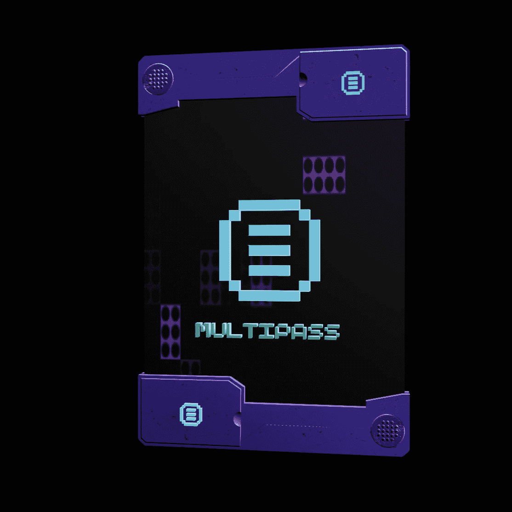

# Entities MultiPass

**实体多通道**

一个包含 4,000 个 NFT 的集合，标志着 Entities 的起源，这是一个由艺术家为艺术家构建的生成 NFT 集合的无代码启动板。获得 MetaGeckos 的独家铸币前访问权、即将推出的生成掉落物以及会员专属特权并参与 Entities DAO。

MultiPass 是一个特别版的实体掉落物，为您提供早期进入实体生态系统的独家机会。烧掉它来铸造一个 Genesis MetaGecko，它可以按比例解锁 Entities Founder 的 DAO 所有权、访问权限和特权。持有您的 Genesis MetaGecko 来铸造第 1 代 MetaGecko，并在正在进行的 $NTTZ 分发中获得您的份额。持有 Gen 1 MetaGecko 以获取对当前和未来实体集合的白名单访问权限。

