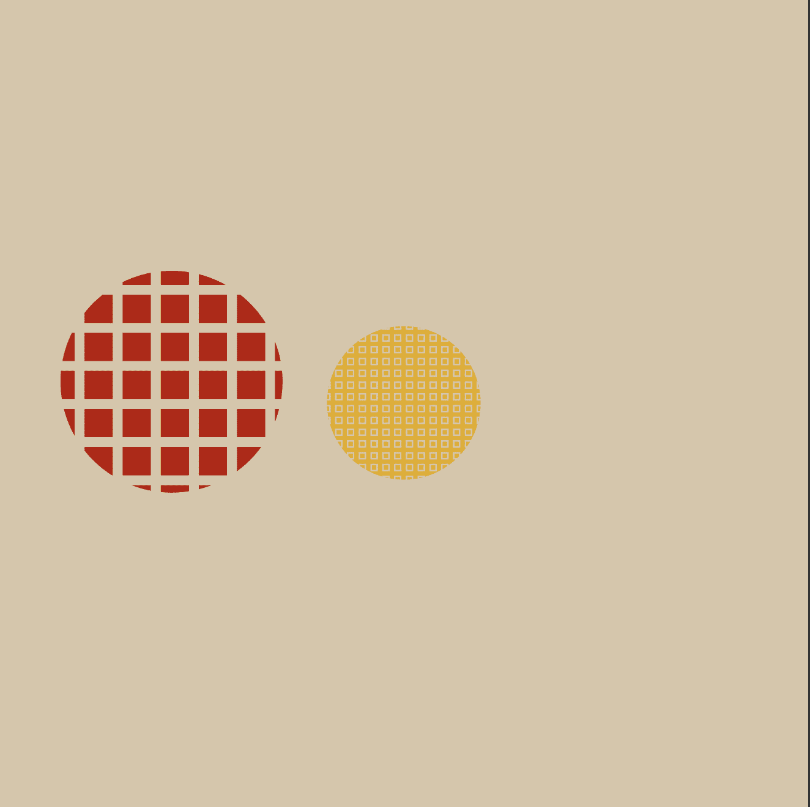

# Entrope

**熵**

收集传统艺术，分享多人艺术。

我们是一种在协议级别进行协作的新型生成艺术。一款大型多人链上创作游戏。我们随着我们在区块链上的交换而发展。当您铸造或购买 Entrope 时，我们进化的下一步将根据您唯一的钱包地址（不是 tx 哈希，尽管铸造使用 tx 作为盐）呈现为代币。我们的进化趋向于不断增加的视觉复杂性，我们链中的每个所有者都在为我们的实现做出贡献。收藏家成为创造者。你一起讲述我们的故事。

关键规则

1. 断开连接：在您上次拥有熵的 10 次转移内重新获得您之前拥有的熵将导致断开连接。您需要将其出售或转让给有效的所有者才能重新连接。
2. 事件是暂时的。有些像“Shiny”有衰减。
3. 熵可以无限进化多次。

多人游戏 > 单人游戏 🎮 增长链条 🌱

