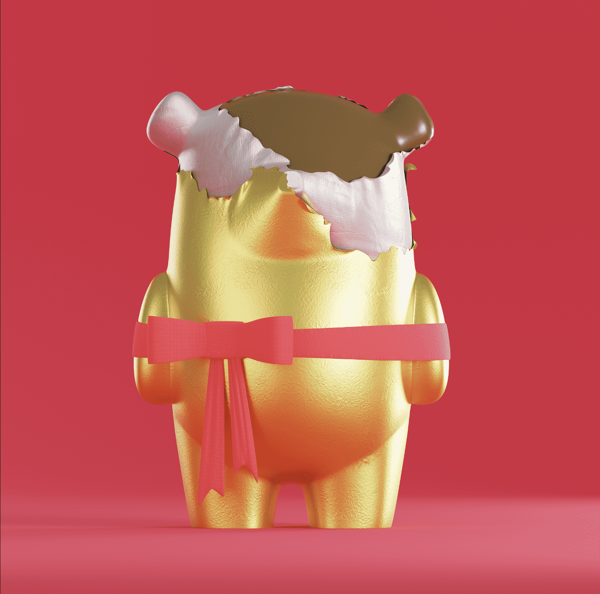

# Erto

**尔托统计**

创建于 1 年多前，45 代币供应，10% 费

过去 7 天内没有出售 Erto。

Erto 数字艺术玩具项目的灵感来自可收藏的设计师玩具运动。每个 Erto 都是受城市文化、当代艺术和迷人美学影响的限量版。

Erto NFT - 常见问题（FAQ）

▶ 什么是 Erto？

Erto 是一个 NFT（不可替代代币）集合。存储在区块链上的数字艺术品集合。

▶ 有多少 Erto 代币？

总共有 45 个 Erto NFT。目前，144 位所有者的钱包中至少有一个 Erto NTF。

▶ 最近卖出了多少 Erto？

过去 30 天内售出 0 个 Erto NFT。

