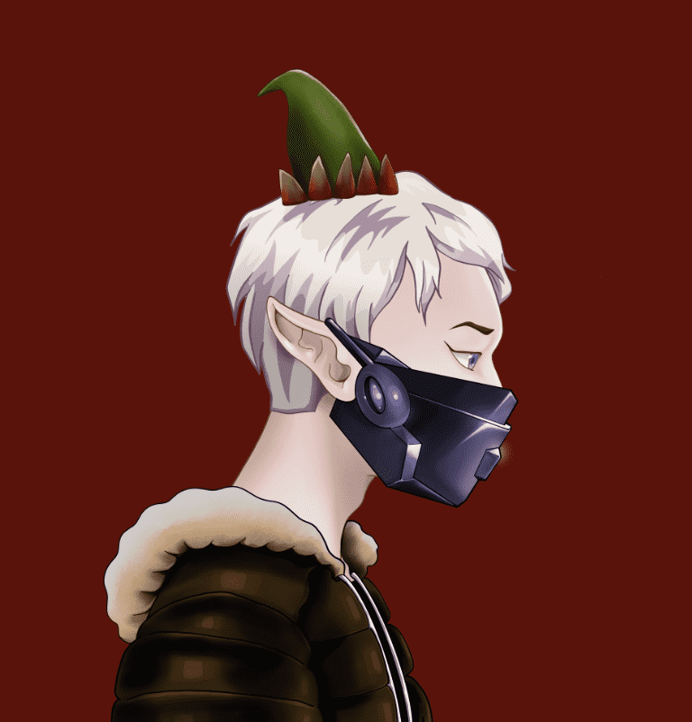

# Eternal Elves

Eternal Elves 是在以太坊区块链上创建的 5000 个手绘 NFT 的集合。 精灵拥有超过 150 种特征，分为 5 个部落和代表这些部落的不同特征。 最初铸造的 1750 个精灵将完全免费，其余 3250 个精灵的价格为每 NFT 0.006Ξ，每笔交易最多 5 个。

永恒精灵 NFT - 常见问题（FAQ）
▶ 什么是永恒精灵？
Eternal Elves 是一个 NFT（非同质代币）集合。存储在区块链上的数字艺术品集合。
▶ 永恒精灵代币有多少？
总共有 4,999 个永恒精灵 NFT。目前，749 位所有者的钱包中至少有一个 Eternal Elves NTF。
▶ 最近卖出了多少永恒精灵？
过去 30 天内共售出 0 个 Eternal Elves NFT。
▶ 什么是流行的永恒精灵替代品？
许多拥有 Eternal Elves NFT 的用户还拥有 EL NUMEROS、 DegenOkayBears、 WaterBe4nZuki和 Old Legacy。

