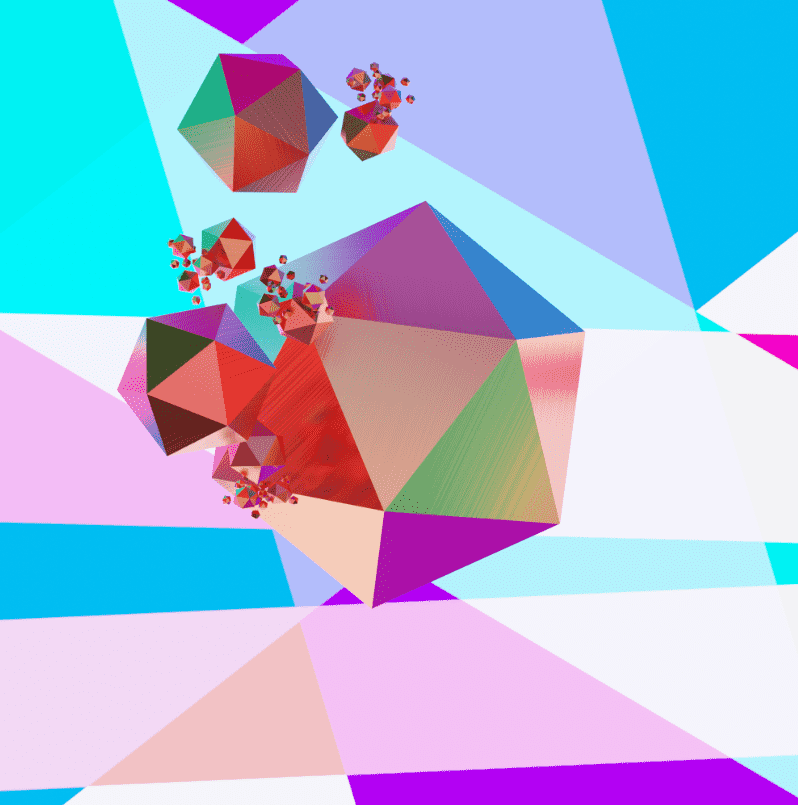

# ETERNAL FRAGMENTS

Eternal Fragments 是 2,828 件生成艺术作品的集合，完全由铸币厂交易决定，并使用递归数学在铸币后 3D 中呈现。 UtilityEternal Fragments 是 Spectra Art 的黎明三部曲的第 1 部分。 Dawn Trilogoy 的收藏家将能够索取 Dawn Key 并获得独家优惠，包括预售访问权和未来 Spectra.Art 项目的折扣。关于项目 3D 生成算法渲染分形几何和体积照明来表达铸币厂的交易哈希。 结果展示了递归数学规则同时产生的混乱和秩序。稀有度排名：https://www.eternal-fragments.art/#/rarityAbout Spectra：https://www.spectra.art

每件作品的生成都是由铸币行为催化的。铸币厂的交易哈希和代币 ID 结合起来创建一个种子哈希，每个特征都直接从种子产生。

每个铸币交易产生的材料参数化和光动力学都是根据这些定律从 3D 模拟中呈现的。因此，表征每个永恒碎片的折射、反射和光影在物理上都是准确的。

