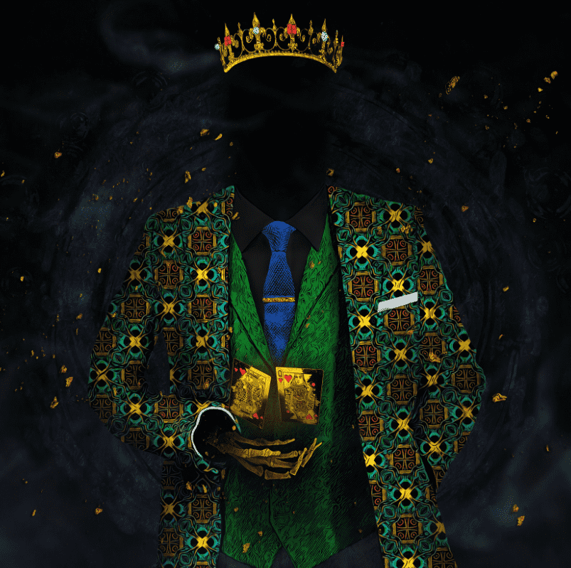

# Eternal Royals Official

Eternal Royals 是由 The Dope Art 的 Jesse Johnson 手工制作的 9,224 个国王和王后的集合。 这个项目的独特之处在于数字和物理的结合。 代币持有者可以选择在 30x40 英寸的画布上获得 1 幅皇家版画，以及其他未来福利。

数字与物理相遇的地方

Eternal Royals NFT 系列包括 9,224 个独特的国王和王后，将数字艺术与帆布印刷品相结合。持有皇室成员是您进入该领域的钥匙，包括访问限量版艺术品、IRL + 虚拟活动、您的 NFT 印刷品中的 1 件等等！查看包含 224 个手工制作的“OG”和 STAY ROYAL 的 SOLD OUT 系列！👑

