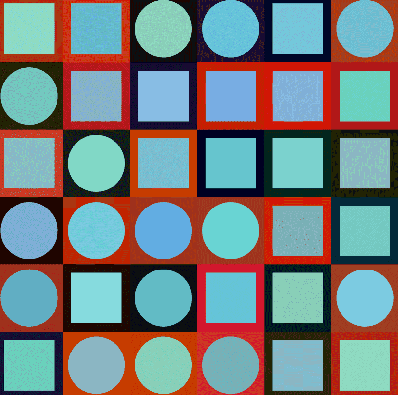

# Eth-arely

永远只有 555 个 Eth-arely NFT - 正式售罄 Eth-arely 系列向 1900 年代中期的匈牙利艺术家 Victor Vasarely 致以真正的敬意。 他的艺术作品是同类作品中的首创，利用色彩缤纷的几何形状创造出扭曲的三维现实。 这个展示的主要灵感来自他的收藏“Planetary Folklore Participations”。收藏中的每一件作品都是通过算法生成的，使得每个 NFT 都成为托管在以太坊区块链上的完全 1/1 代的艺术创作。 Nfts 的同等价格为 0.02 Eth，并将具有基于大小、类别和稀有度的适当元数据属性。 每笔交易最多 1 个 NFT。

