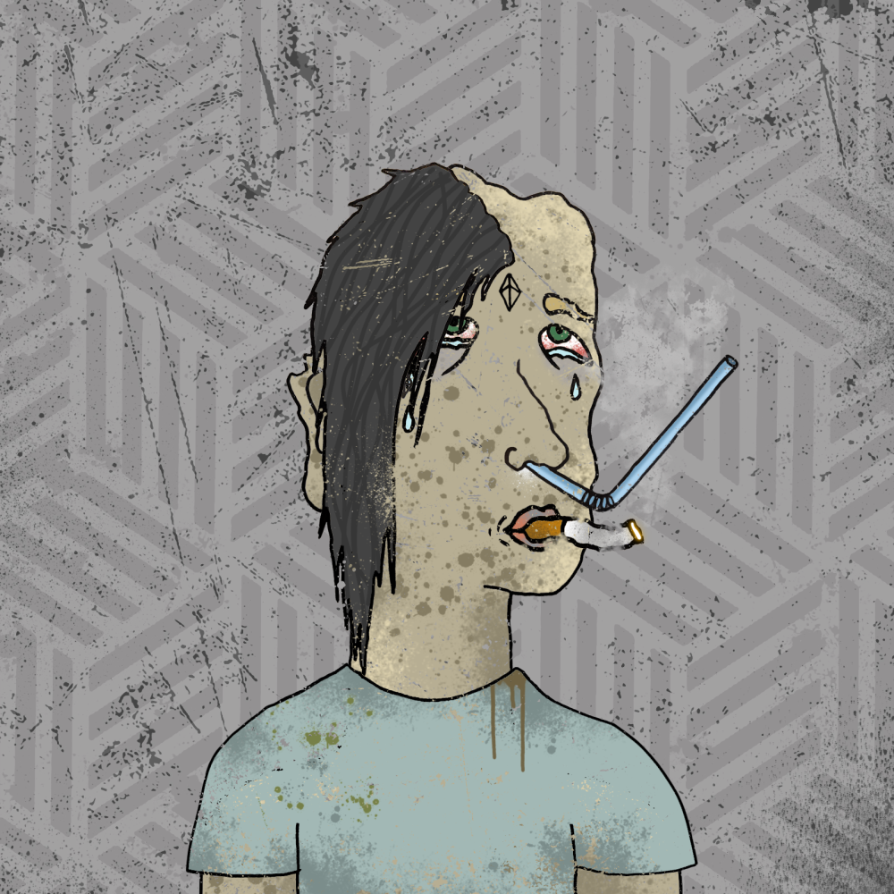

# ETH-HEADZ

布满血丝的眼睛，难闻的气味，屏幕漂白的糊状皮肤？你在电脑前花了太多时间——我认为可以肯定地说你是 NFT 上瘾者。5000 Eth-Headz 即将离开康复中心并重新加入社会。Rock one 作为您的 PFP，向世界展示您沉迷于 NFT！由 Magic Mork 创建的 Eth-Headz 是从 260 多种手绘特征中随机生成的。很有可能，至少会有一个看起来像你的人......“路线图”复苏之路是漫长而险恶的。第一步是承认你有问题——你可以通过拥有一个 Eth-head 来做到这一点。作为所有者，您将有资格获得免费的 NFT - Eth-Headz 的未来伴侣掉落物，以及 Magic Mork 收藏中的常规艺术品掉落物。他们还将授予您访问 Discord 中会员仅 1/1 拍卖和赠品的权限。随着我们进一步进步，我们可以尝试并完成社区建议的任何事情 - 未来掌握在您手中！

ETH-HEADZ NFT - 常见问题（FAQ）
▶ 什么是 ETH-HEADZ？
ETH-HEADZ 是一个 NFT（不可替代代币）集合。 存储在区块链上的数字艺术品集合。
▶ 有多少个 ETH-HEADZ 代币？
总共有 746 个 ETH-HEADZ NFT。 目前 73 位所有者的钱包中至少有一个 ETH-HEADZ NTF。
▶ 最昂贵的 ETH-HEADZ 销售是什么？
出售的最昂贵的 ETH-HEADZ NFT 是 ETH Headz #729。 它于 2022-06-16（2 个月前）以 22.2 美元的价格售出。
▶ 最近卖出了多少个 ETH-HEADZ？
过去 30 天内售出 1 个 ETH-HEADZ NFT。

