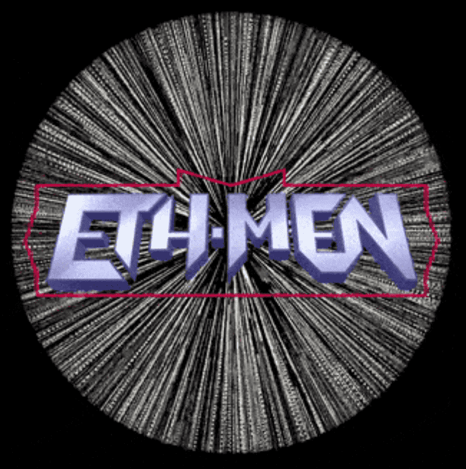

# ETH-MEN RELOADED

ETH-MEN 系列

ETH-MEN 是同类 NFT 中的第一个，专注于将可收藏动作人物的古老体验带入以太坊区块链。

ETH-MEN 重装 NFT - 常见问题（FAQ）
▶ 什么是 ETH-MEN RELOADED？
ETH-MEN RELOADED 是一个 NFT（不可替代令牌）集合。存储在区块链上的数字艺术品集合。
▶ 有多少个 ETH-MEN RELOADED 代币？
总共有 61 个 ETH-MEN RELOADED NFT。目前，579 位所有者的钱包中至少有一个 ETH-MEN RELOADED NTF。
▶ 最昂贵的 ETH-MEN RELOADED 销售是什么？
出售的最昂贵的 ETH-MEN RELOADED NFT 是 ETH-MEN/CP5027/1st edition。它于 2022-08-06（28 天前）以 112.6 美元的价格售出。
▶ 最近卖出了多少 ETH-MEN RELOADED？
过去 30 天内售出了 1 个 ETH-MEN RELOADED NFT。

