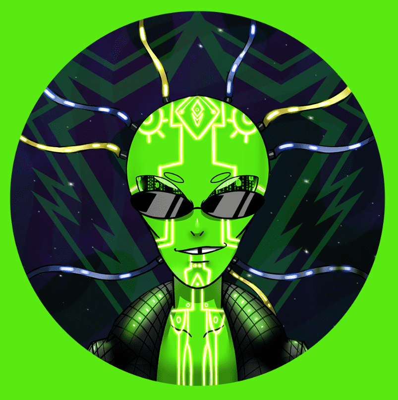

# Ethalien

Ethaliens 是生活在地球上并居住在区块链上的 7,500 名外星人。 从 Zerkton 星球出发，Ethaliens 不得不逃离他们的家园星球，因为它被 Satoshiens 摧毁了。 Ethaliens 发现了地球，并决定将其作为基地来策划他们的复仇……Discord：https://discord.gg/ethalien Twitter：https://twitter.com/EthaliensNFT 稀有工具：https://rarity .tools/ethalien PopRank：https://poprank.io/ethalien

▶ 什么是犹太人？
Ethalien 是一个 NFT（不可替代代币）集合。存储在区块链上的数字艺术品集合。
▶ 有多少 Ethalien 代币？
总共有 7,500 个 Ethalien NFT。目前，1,842 名所有者的钱包中至少有一个 Ethalien NTF。
▶ 最昂贵的 Ethalien 销售是什么？
出售的最昂贵的 Ethalien NFT 是 #7488。它于 2022-08-04（大约 1 个月前）以 140.7 美元的价格售出。
▶ 最近卖出了多少 Ethalien？
过去 30 天内售出了 206 个 Ethalien NFT。
▶ Ethalien 的价格是多少？
在过去 30 天里，Ethalien NFT 最便宜的销售额低于 14 美元，最高销售额超过 57 美元。过去 30 天内，Ethalien NFT 的中位价格为 24 美元。
▶ 什么是流行的 Ethalien 替代品？
许多拥有 Ethalien NFT 的用户还拥有 Ethalien VOX、 Baby Ethalien、 Joey Mob和 Roo Troop。

