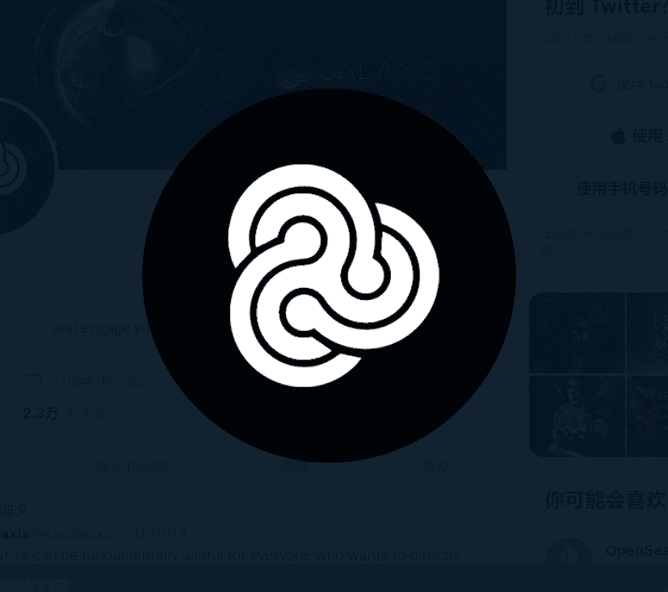

# Ether Cards Founder

以太卡是高级限量版 NFT 卡，为所有者提供以太卡平台上的好处，例如免费服务、折扣、VIP 访问通行证、NFT 掉落和其他特殊特征。 卡的好处将很快扩展到其他平台、现实世界的活动、物品和行业。 OG是最强大的卡片，除了“意外合作”艺术品外，还有顶级艺术家的艺术品。 除了随机和条件特性之外，这些卡还包含至少 3 个限制特性槽。 OG 很可能会获得最强大的特殊特性版本。 Alpha 是强大的卡片，其艺术与 OG 相似，除了随机和条件特性外，至少拥有 2 个限制特性槽，并且有很高的机会获得强大的特殊特性。 创始人有“意外合作”的艺术品。 除了任何随机和有条件的特质外，这些卡还拥有至少 1 个限制特质插槽，并有机会获得强大的特殊特质。

