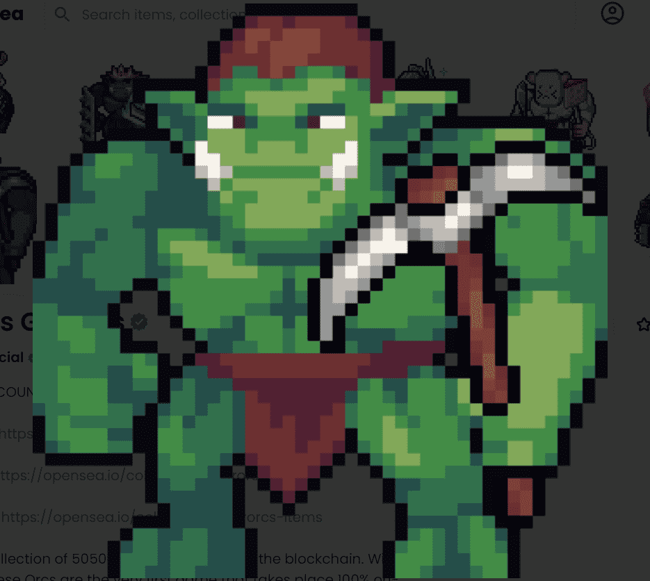

# Ether Orcs

实际拥有者数量：截至 22 年 8 月 23 日，共有 1520 人，其中 93% 参与游戏。EtherOrcs 盟友：https://opensea.io/collection/etherorcsalliesEtherOrcs 战利品：https://opensea.io/collection/etherorcslootEtherOrcs 物品：https： //opensea.io/collection/etherorcs-itemsEtherOrcs 是 5050 个准备掠夺区块链的兽人的集合。 在没有 IPFS 或 API 的情况下，这些 Orcs 是第一款 100% 在链上进行的游戏。 使用你的兽人探索 Valkala 的世界，爬行实时地牢，制作装备，定制你的角色和建筑。访问我们的网站了解更多信息：https://etherorcs.com/

EtherOrcs 是一个 100% 的链上游戏和生态系统。兽人和他们的盟友进行突袭、掠夺、旅行等等。

EtherOrcs 世界中的每个集合都有一个独特的实用程序，可以访问游戏中的代币，这些代币可以推动大多数行动和奖励。

通过互动和战略性的游戏玩法，玩家可以获得更好的装备、更多的 NFT，并在基于以太坊区块链的沉浸式生态系统中竞争。

凭借强大的开发管道和超额交付改变行业的创新的记录，总是有新的冒险和宝藏在等待着即将到来的兽人。

