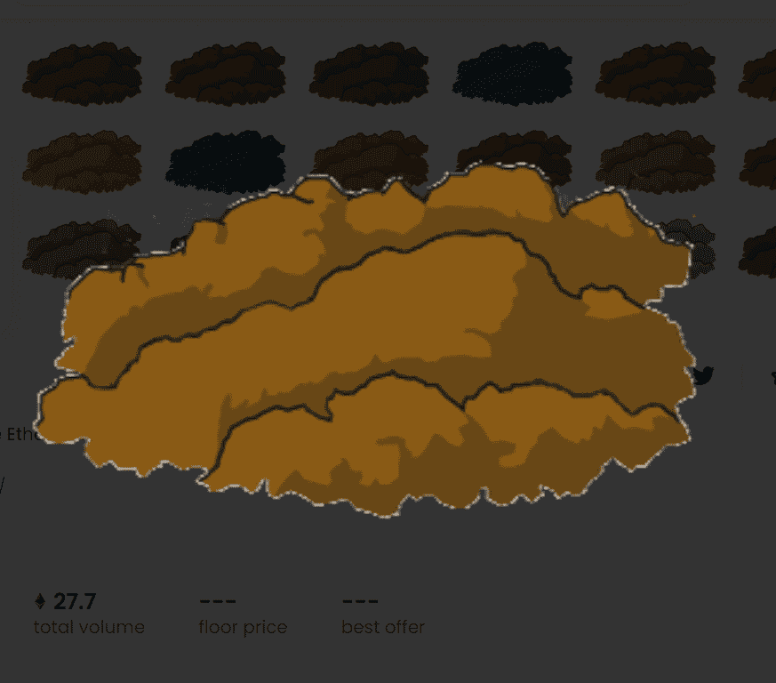

# EtherDirt

以太污垢 - 区块链上的宠物污垢
EtherDirt 于 2021 年推出，是充斥以太坊区块链的众多衍生加密收藏 NFT 类型项目之一，但推出得太晚，没有任何实际价值。 从好的方面来说，只有 100 堆泥土可用，而且每一堆新的原始泥土变得越来越昂贵。 该游戏完全建立在以太坊区块链上，使用去中心化智能合约（在此处查看）用于管理包括购买和出售泥土在内的一切（尽管该网站仍然是必要的，因此您可以看到漂亮的泥土图片）。

最新处女污垢 [从未售出]

土卖开放泥土堆按由等式price = (0.001 + 0.001\(DirtID)^2)/8**确定的递增价格列出，从 0.00025Ξ 开始，直到所有 100 个泥土堆都已售出。业主可以在购买后立即列出他们的一堆泥土出售或转移到其他地址。

所有活动（使用）污垢

下面的所有泥土都至少购买过一次 - 如果他们愿意，业主可以将它们列出出售。

