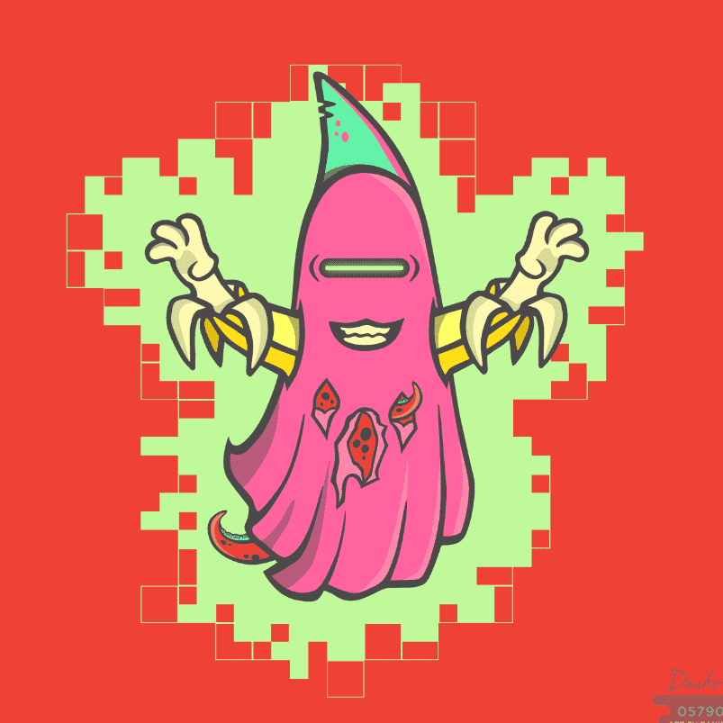

# ETHEREALS WTF

ETHEREALS 是 12,345 个手绘、随机生成的跨维度幽灵。 他们的特征来自元宇宙的各个方面，包括令人惊讶的文化参考混搭。 ETHEREALS 是穿越时空寻找乐趣的永恒存在！ ETHEREALS 持有者可以质押他们的 ETHEREALS NFT 来赚取 $boo 代币，然后他们可以兑换一个 ETHEREALS ORIGIN PFP。 访问 staking.ethereals.wtf 进行质押、认领和铸币。 ETHEREALS 起源于 OpenSea.ETHEREALS 航海者系列 1 在 OpenSea 上。 Ethereals 官方链接。Danko 是 Ethereals 背后的首席艺术家。 他也是 Mayhem Island Bananas 的创作者，并以他在美术界的流行超写实油画而闻名。

每个 Ethereal 都有自己独特的多维属性组合。它们包括与起源相关的面部特征、光环、手臂、床单和头饰等特征。这些薄片让他们能够在跨维度旅行中保护自己的宇宙形态。

