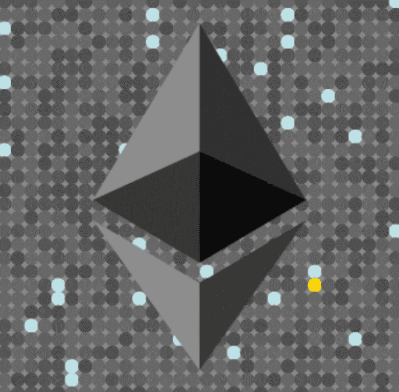

# Ethereum (wheregold.com)

黄金在哪里？ 每个项目都是使用随机矩阵随机生成的。 有时会有彩色圆点，也许你会发现一些金子。 （黄金 = #FFD700）。$ETHG | 0x9b48677d87581b12099beb2db05574e0d9bc2ce4 | 供应500 | 空投 50%

以太坊（黄金在哪里？）NFT - 常见问题（FAQ）
▶ 什么是以太坊（黄金在哪里？）？
Ethereum (Where's The Gold?) 是一个 NFT (Non-fungible token) 集合。存储在区块链上的数字艺术品集合。
▶ 有多少以太坊（黄金在哪里？）代币存在？
总共有 500 个以太坊（黄金在哪里？）NFT。目前，118 位所有者的钱包中至少有一个以太坊（黄金在哪里？）NTF。
▶ 最近卖出了多少以太坊（黄金在哪里？）？
过去 30 天内售出 0 个以太坊（黄金在哪里？）NFT。

