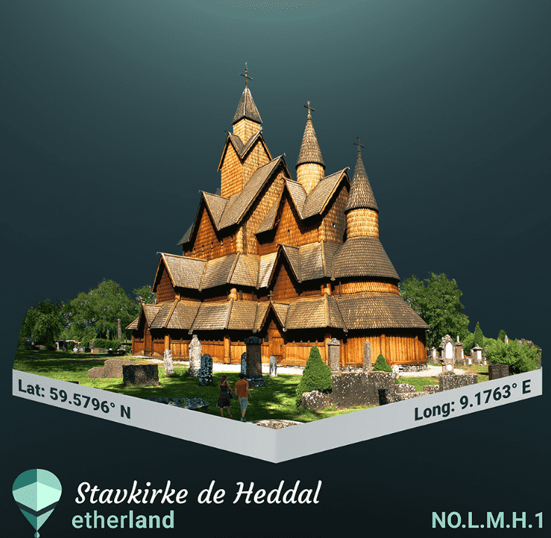

# Etherland

使用 IPFS 技术，Etherland 正在将物理房地产和世界各地的数据与建立在以太坊区块链上的数字层连接起来。 这个虚拟层或 Etherland 的 Earth Metaverse，以名为“Land ID”的不可替代代币的形式显示地球上每个房地产和地点的唯一身份代币。每个 NFT 代表一个真实地点，还授予所有者对地球上的控制权 链接到他们的令牌并存储在 IPFS 网络上的信息。 在这个元界上，用户可以使用加密货币购买、注册、申领、创建、推广、验证他们的 Land ID 代币并从中获利。 任何人都可以自由地为构建 Etherland 的 World Metaverse 做出贡献。

将区块链连接到全球房地产
欢迎来到由人民根据不可变的区块链协议构建、拥有和管理的 Estatepedia。 因创建和质押代表现实世界的数字资产而获得奖励。

