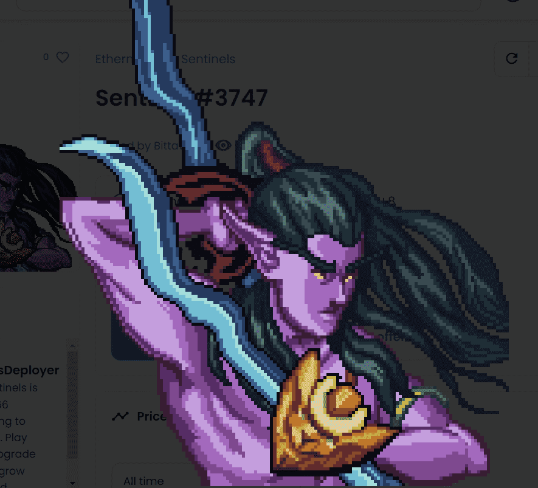

# EthernalElves

以太精灵部署器
欢迎来到 ElvenverseEthernal Elves 是一群哨兵和长老在沼泽中发动战争的集合。 壮大你的军队，赚取 $pREN，升级，寻找物品，制作武器等等。这款游戏是无气且免费的。 您需要至少三个哨兵才能有效发挥。探索 ElvenverseSentinels：https://opensea.io/collection/ethernalelves Elders Collection：https://opensea.io/collection/ethernalelves-elders Artifacts Collection：https://opensea。 io/collection/ethernalelves-artifacts 战利品收集：https://opensea.io/collection/ethernalelves-loot更多关于 Elvenverse：https://www.ethernalelves.com/

起初，只有永恒的寒冷和黑暗……直到有一天，第一道光的火花在宇宙中爆炸，折射在永恒水晶中。从那奇异的光束中，诞生了一个完整的宇宙，而在那个宇宙中，生命在无边无际的星辰大海中一下子形成。

许多危险等待着哨兵在旅途中，因为沼泽生物被培育来谋杀精灵。然而，被杀的生物含有 $MIREN，这是一种富含矿物质的血液，可用于支持精灵。在战争中丢失或被泥潭留下的武器仓库可以被哨兵找到并突袭。最终，他们可能拥有超越沼泽所需的力量，无论他们潜伏在哪里。

