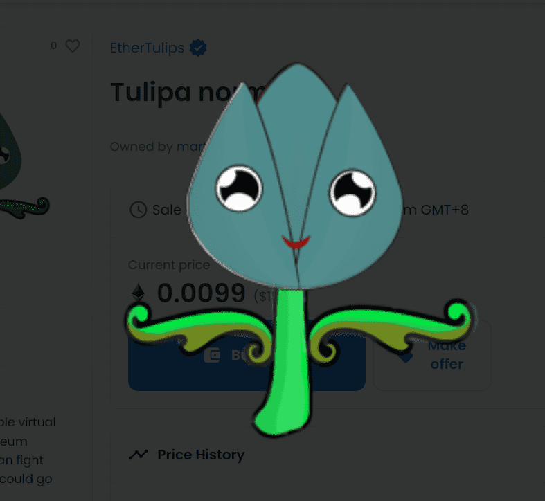

# EtherTulips

申请花园地块🌷 Mint Gen 2021Discord | 推特 | ethertulips.com | 美东时间。 2018年1月这是EtherTulips的正式升级合约！ EtherTulips Legacy 代币可以在 legacy.ethertulips.com 进行管理，并在 EtherTulips Legacy OpenSea Collection 上进行交易。 EtherTulips 桥可以在旧合约和升级合约之间转移您的郁金香。 有关我们的合约升级的更多信息，请参阅我们的博客文章。以太坊区块链上的可交易虚拟郁金香可以相互对抗。 会出什么问题？

郁金香狂热。现在打架。在区块链上。

郁金香狂热是 17 世纪的泡沫，在此期间，郁金香的价格上涨到荒谬的水平。一个灯泡比房子还贵！郁金香市场在 1637 年崩盘，所以你来不及参与——但不用担心！

我们将郁金香狂热带入 21 世纪。每个可爱的 EtherTulip 都生活在以太坊区块链上，在那里可以安全地购买、交易和战斗。所有以太郁金香都有独特的 DNA，这决定了它们的外观和战斗特征。想要一个特别强大的郁金香？购买一些种子，或与其他人交易。但要快点：价格每天都呈指数级上涨。你不想错过，是吗？

