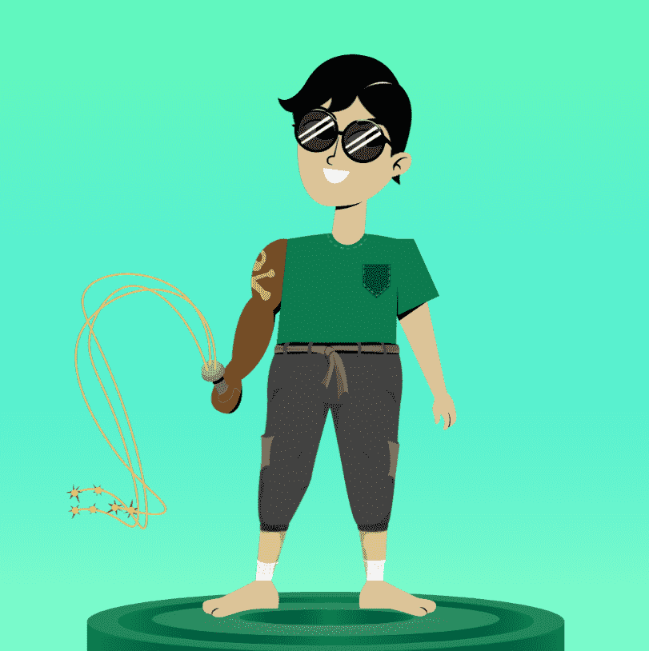

# Ethlings

过去 7 天内没有出售任何 Ethling。一系列可定制的 NFT。

当你铸造一个 Ethling 时你会得到什么
7777 总供应量。0.1111 以太币。

1 埃林可自定义的头像随机物种和子类型OpenSea 和 ERC-721 兼容

更多关于 Ethlings

限量版可穿戴 NFT
最多 11 个限量版可穿戴设备随机分配兼容 Opensea 和 ERC-1155

更多关于 Ethlings 可穿戴设备的信息

1,000 Ethlings 代币 ($ET)
可用于升级您的Ethling可自由交易兼容ERC-20更多关于代币经济学

元界集成
（即将推出）3D 文件和模型体素兼容性 在元节中免费使用

查看 3D 画廊加入我们的 Discord 以保持更新

交易可穿戴 NFT 并定制您的 Ethling

快来了：元界能力
随身携带您的 Ethling。这不仅仅是另一个头像项目。这是您在区块链上的个人代表。

首创的技术
Ethlings 经济建立在新技术之上。

