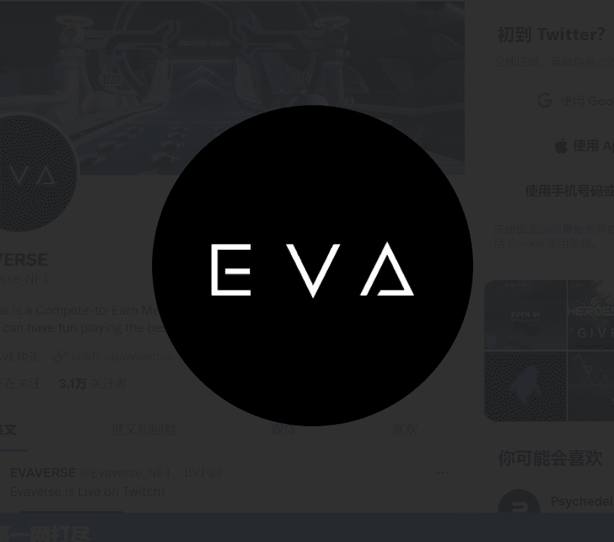

# Evaverse

Evaverse NFT Collection 是一套 10,000 1/1 独特的 ERC-721 精美动画 3D 化身。 每个化身由多达 19 个可能的独特特征创建，总共可能创造 4.3 亿个独特的变化。 某些化身将具有极其罕见的特征。每个 NFT 都是 Evaverse 视频游戏中的一个可操纵的动画可玩游戏角色。 Evaverse 是一款为 NFT 社区打造的多人社交游戏。 Evaverse NFT 持有者将能够对未来的游戏更新设计机制提出建议和投票。 该游戏将在 NFT 公布后在 Steam 上推出。EVAVERSE 视频游戏可以在 Steam 上玩。 访问 evaverse.com 了解更多信息 Evaverse Turtle Troop - Evaverse Hoverboards

Evaverse 视频游戏是为 NFT 社区打造的多人社交平台。该游戏目前可通过 Steam 商店在 PC 上的所有玩家使用。玩家可以在沉浸式 3D 环境中玩迷你游戏和与其他社区成员闲逛时创建服务器、结识其他收藏家并展示他们的 Opensea NFT。长期愿景是与 NFT 社区一起扩展 Evaverse 游戏。Evaverse NFT 持有者将在我们将 Evaverse 构建成一个庞大的游戏赚钱世界时提出游戏更新和未来设计机制。

