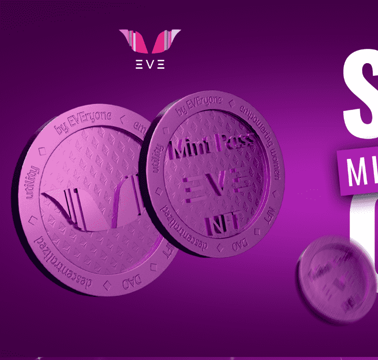

# EVE Mint Pass

我们是一个由技术、文化、创业和金融市场领域的领先女性创建的社区，我们相信可以创建一个具有包容性和代表性的 Web 3.0。我们正在采取措施通过教育和财务独立来增加多样性 ，为世界各地的任何人创造机会，让他们在这个新的互联网时代拥有、创造和协作。

薄荷通行证
我们将以 400 张非常特别的薄荷通行证开始我们的项目！ 除了作为 EVE DAO 的治理代币外，它还提供多项独家福利和实用程序，例如免费铸币厂、空投和参加独家活动！

销售额的 20%
NFT 社区赠品：我们对包容性、可访问性和社区充满热情！ 这就是为什么我们想为没有可用资源投资 NFT 的女性提供机会，让她们成为 EVE 和我们正在建立的这个美妙社区的一部分！

销售额的 40%
获取内容、指导和研讨会：我们的创始人是他们专业领域的参考，并为我们的持有者准备了关于金融、营销、增长、加密、创业、摄影、音乐、技术和创新的令人难以置信的内容！ 他们将分享他们在生活中学到的很多东西，以及迄今为止对他们的职业产生影响的东西。

