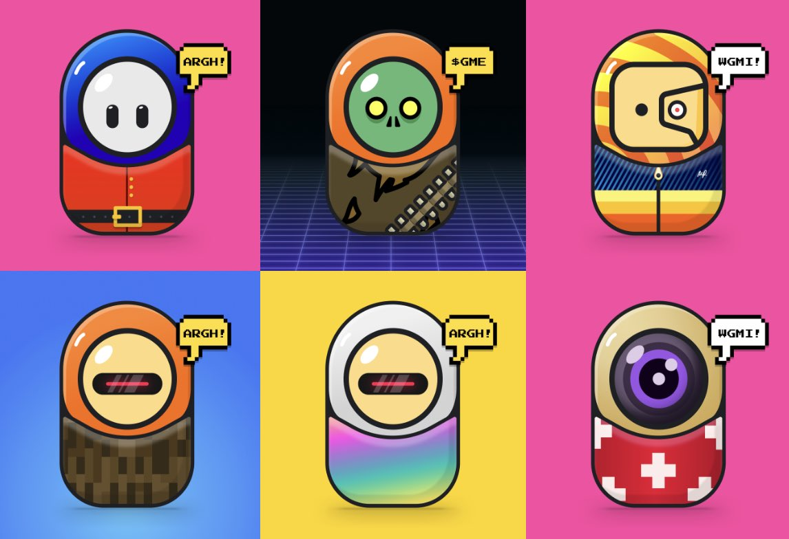

# Event Horizon Generative

Event Horizon 是 Maksim Petriv 创作的艺术作品集。每件作品都是使用自定义算法生成的，并被精心挑选到收藏中。过去 7 天没有售出 Event Horizon Generative。

▶ 什么是事件视界生成器？
Event Horizon Generative 是一个 NFT（不可替代代币）集合。存储在区块链上的数字艺术品集合。
▶ 存在多少 Event Horizon Generative 代币？
总共有 80 个 Event Horizon Generative NFT。目前，43 位所有者的钱包中至少有一个 Event Horizon Generative NTF。
▶ 最近售出了多少 Event Horizon Generative？
过去 30 天内售出 0 个 Event Horizon Generative NFT。

