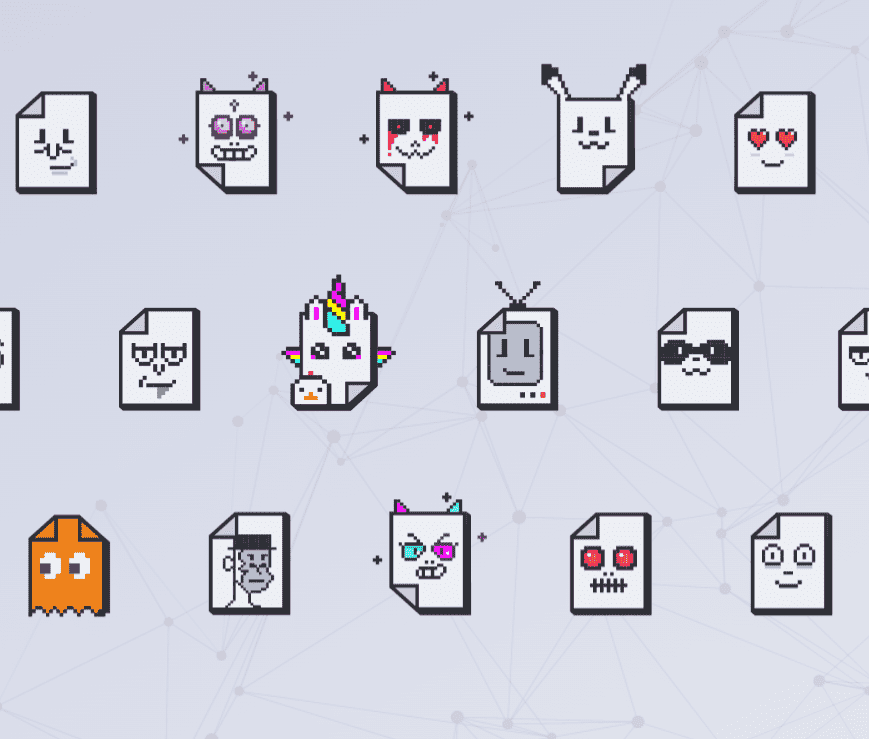

# Eventos NSUJPG

代币的用途是什么？
拥有 Not Just a JPG 代币后，您将自动成为社区的独家成员，从而获得特殊福利。

• Not Just a JPG 代币的每位拥有者都可以参加为期 3 年的独家为期两天的在线活动，该活动每年举办一次。该活动将重点关注新的区块链技术、NFT、创造力和创新、生成艺术、元界以及这些技术的未来。此外，我们还将有 NFT 和区块链技术领域的演讲者和专家嘉宾。此外，您将可以访问 Discord VIP 社区。

• 在该系列中，有 10 个具有独特背景的代币将被拍卖。这些代币让您可以访问与 Euge 和 Humberto 为期 3 年的季度小组 Mastermind，我们将在其中共同帮助您完成 NFT 项目，评论该领域的最新发展，或者只是进行愉快的会谈。

• 收藏中最稀有的代币是 4 枚用于拍卖的黄金代币。除了具有之前的所有好处之外，这些代币还有一个特殊的实用程序，可以让您出现在 Not just a JPG 的 YouTube 频道上。在 2024 年 12 月之前，每个 Token 最多可以使用 3 次（您可以在 Discord 社区中查看每个 Token 的可用用途）。

• 某些秘密属性可让您参与我们全年准备的特殊活动、抽奖和惊喜（14 个特殊代币的持有者将可以访问所有这些活动）。

• 所有关于事件、策划者、惊喜和社区感兴趣方面的信息都将通过 Discord 共享。

