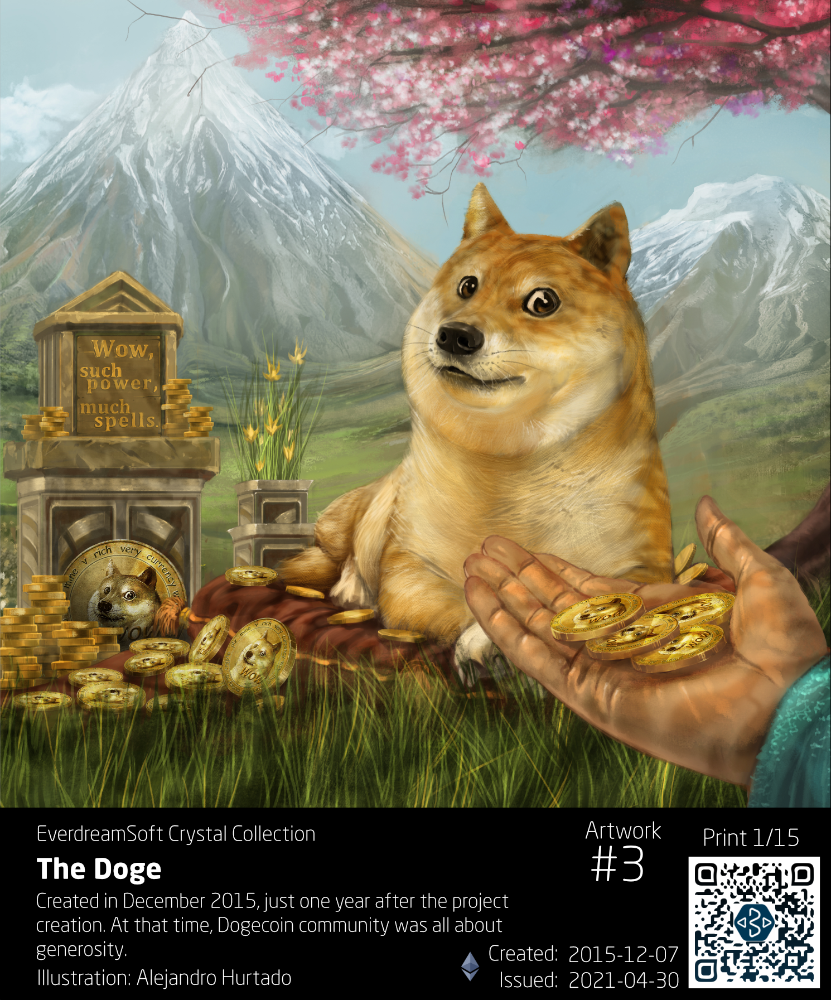

# EverdreamSoft Crystal Collection

Crystal Collection 是一个独特的 NFT 原创艺术品“版画”收藏，具有重要的历史价值。Crystal Collection 由 EverdreamSoft (EDS) 创建，该公司在 2015 年由首批 ICO 之一资助了首批区块链游戏之一 - Spells of Genesis (SoG)。

在这个系列中，EDS 追溯了区块链历史中一些最重要的事件和项目，使用最初创建的原创艺术品作为 SoG 中第一批区块链可交易卡的一部分。

每件艺术品都以有限数量的“印刷品”（1 到 15 个）铸造，每件带编号的印刷品都附在 NFT 上。这些艺术品是在不同的区块链上铸造的。

