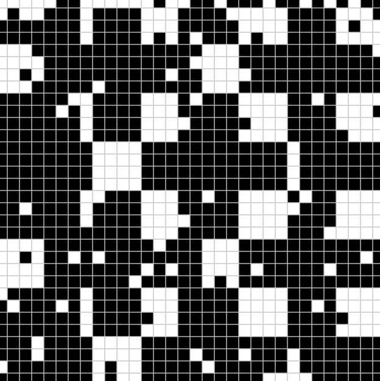

# Every Icon

对 Every Icon 的重新构想，John F. Simon Jr. 的开创性的基于网络的软件艺术作品于 1997 年首次发布。这种区块链原生的链上表达由 John F. Simon Jr. 和分歧创造，在 与 FingerprintsDAO 和 e•a•t•}works 合作了解更多信息，请访问 https://everyicon.xyz

每个 Icon NFT 在过去 7 天内售出 2 次。Every Icon 的总销售额为 1.25 万美元。一个 Every Icon NFT 的平均价格为 625.7 美元。有 312 位 Every Icon 所有者，总共拥有 512 个代币。

Every Icon NFT - 常见问题（FAQ）
▶ 什么是 Every Icon？
每个图标都是一个 NFT（不可替代令牌）集合。存储在区块链上的数字艺术品集合。
▶ 有多少 Every Icon 代币？
总共有 512 个 Every Icon NFT。目前，312 位所有者的钱包中至少有一个 Every Icon NTF。
▶ 最昂贵的 Every Icon 销售是什么？
售出的最昂贵的 Every Icon NFT 是 Every Icon #181。它于 2022-06-30（2 个月前）以 867.3 美元的价格售出。
▶ Every Icon 最近卖出了多少？
过去 30 天内售出了 12 个 Every Icon NFT。
▶ 每个图标的价格是多少？
在过去 30 天里，Every Icon NFT 最便宜的销售额低于 187 美元，最高销售额超过 742 美元。在过去 30 天内，Every Icon NFT 的中位价格为 261 美元。
▶ 流行的 Every Icon 替代品有哪些？
许多拥有 Every Icon NFT 的用户还拥有 Jan Robert Leegte 的Window、Jan Robert Leegte的 Ornament、 DCA 的 Genesis和 Mutant Garden

