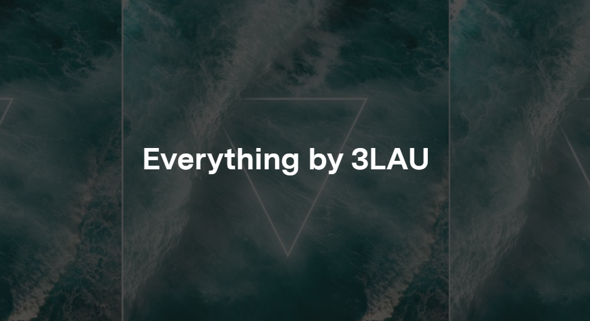

# Everything by 3LAU

3LAU 是一名 DJ 和制作人。他于 2011 年开始发布 mashup，并开始通过这些 YouTube 发布来增加追随者。从 2012 年到 2015 年，他开始巡回演出并发行了几张单曲。他的职业生涯一发不可收拾，并在 EDC Vegas、Electric Zoo、Lollapalooza 等地获得了数亿次直播和露面。

贾斯汀的收藏包含第一首完整的标记化歌曲（下周可兑换，敬请期待）。它还带有一个物理令牌（如下）。

我们很高兴在 Nifty Gateway 上举办第一首代币化的全长歌曲！现在是单曲发布到所有主要流媒体平台的完美时机。我们也喜欢与开放版搭配的独特实物——这是一个历史性的下降。

