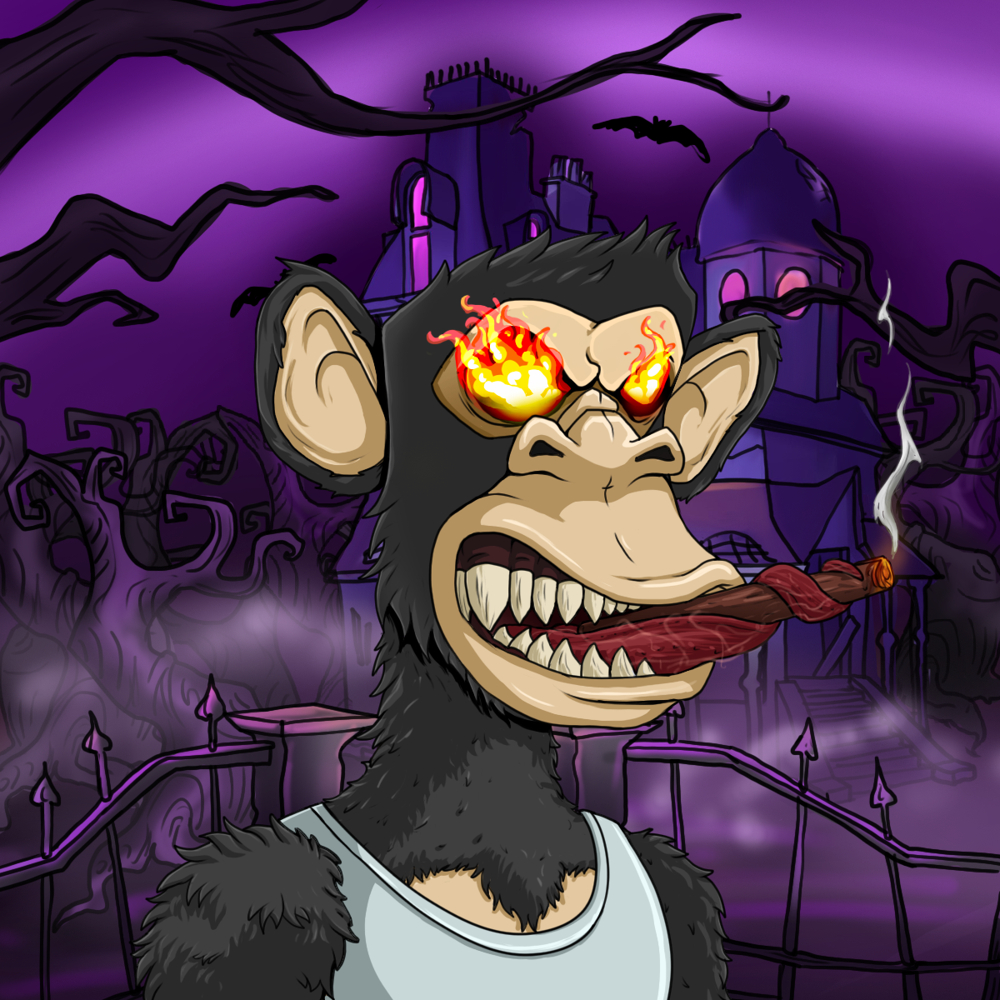

# Official Evil Ape Club NFT

Evil Ape 俱乐部是 6969 个独特
生成的 Evil Ape 的集合，从你的噩梦到以太坊区块链。

15%我们将开始与在 NFT 领域相关且重要的影响者开展额外的营销活动，以便在我们公开发售期间和之后
吸引更多人关注我们的项目。

25%
我们将开始在随机 Evil Ape Club NFT 持有者中将 10 ETH 分配回社区。

50%在 Sandbox 和 Decentraland 中获得土地，以建立我们
在 Metaverse 中的存在。我们相信随着元宇宙的发展，每个人都
需要一个可以称之为自己的地方。我们将获得土地并为 Evil Ape Club 持有者建造一个独特的
会议场所，我们将在其中举办虚拟
社区聚会、节日派对、比赛、EAC 持有者举办
自己的活动的空间等等。

60% 60 ETH 直接进入我们的社区钱包，这将用于：
营销、商品开发和我们的社区 DAO，当
我们进入元界时，持有者将能够对社区决策进行投票

70%我们将做限量版商品。目前，这包括
时尚的 T 恤、连帽衫等。设计将仅限于创造
排他性。商品掉落将限量供应

80%我们将开始启动我们的质押合约，允许 EAC 持有者
赚取 $EVIL 代币。$EVIL 可用于购买 NFT、即将进行的
项目的白名单、限量版 Metaverse 可穿戴设备、限量版 Evil Ape 俱乐部
商品、礼品卡、假期等。

100%路线图 v2.0 - 在路线图 v1.5 完成后，我们将公布
路线图 v2.0……敬请期待……邪恶！

