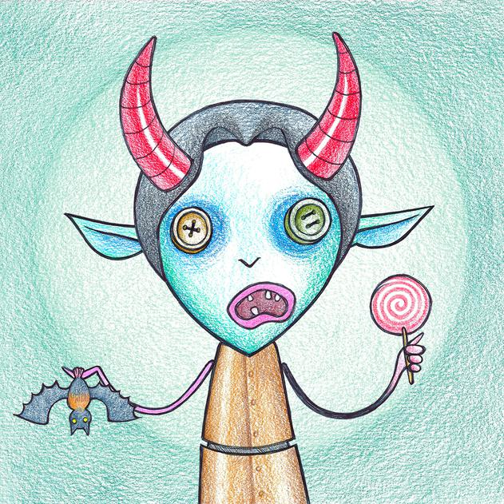

# Evil Dorkis

邪恶的 Dorkis 是小兵、怪人和潜伏者，用钢笔和彩色铅笔在纸上创造了老式的方式，扫描和编辑以制作 4724 个邪恶的克隆。每个 Evil Dorkis 在原始收藏中都有一个特征匹配的对应物。将善与恶结合在一起将有其回报。

我们是一个致力于 NFT 社区的 NFT dorks 团队。我们正在建设一个包容和多元化的社会——庆祝使我们成为独一无二的笨蛋的原因。

Dorkis 是独一无二的，每个特征都是在纸上手绘、着色和扫描的。Dorkis 由近 300 个特征生成！

