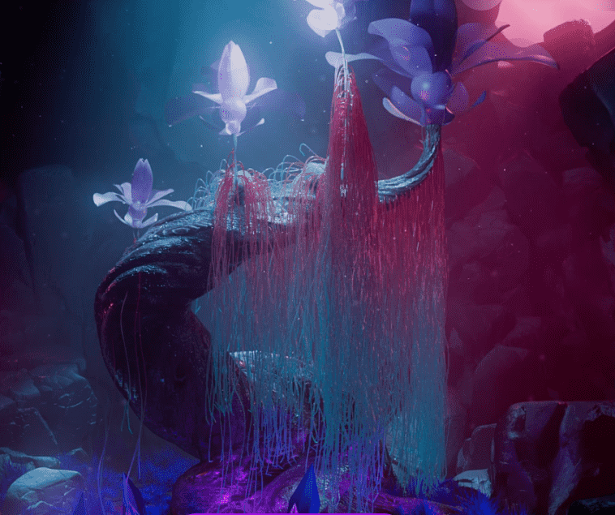

# The Evolving Forest Genesis

Evolving Forest Genesis NFT 在过去 7 天内售出 3 次。The Evolving Forest Genesis 的总销售额为 188.79 美元。The Evolving Forest Genesis NFT 的平均价格为 62.9 美元。有 1,356 名 The Evolving Forest Genesis 所有者，总共拥有 9,344 个代币。

该系列代表 9,336 株神圣的创世纪树苗。这些是古一的第一个孩子，给元宇宙带来了一种新的平静和美丽。

谨防诈骗收集并加入我们的 Discord！

进化的森林创世纪 NFT - 常见问题（FAQ）
▶ 什么是进化之森创世纪？
Evolving Forest Genesis 是一个 NFT（不可替代令牌）集合。存储在区块链上的数字艺术品集合。
▶ 有多少 The Evolving Forest Genesis 代币存在？
总共有 9,344 个 The Evolving Forest Genesis NFT。目前，1,356 位车主的钱包中至少有一个 The Evolving Forest Genesis NTF。
▶ The Evolving Forest Genesis 拍卖中最贵的是什么？
最昂贵的 The Evolving Forest Genesis NFT 是 Evolving Forest #5765。它于 2022-08-28（7 天前）以 126.6 美元的价格售出。
▶ 进化之森创世纪最近卖出了多少？
过去 30 天内售出了 35 个 The Evolving Forest Genesis NFT。
▶ 进化的森林创世纪要多少钱？
在过去 30 天里，The Evolving Forest Genesis NFT 最便宜的销售额低于 16 美元，最高销售额超过 38 美元。过去 30 天，The Evolving Forest Genesis NFT 的中位价格为 28 美元。
▶ 什么是流行的 The Evolving Forest Genesis 替代品？
许多拥有 The Evolving Forest Genesis NFT 的用户还拥有 Raini：The Lords of Light、 Rainicorn Evolved、 Ciphersquares Official和 BlueWorld Metaverse。

