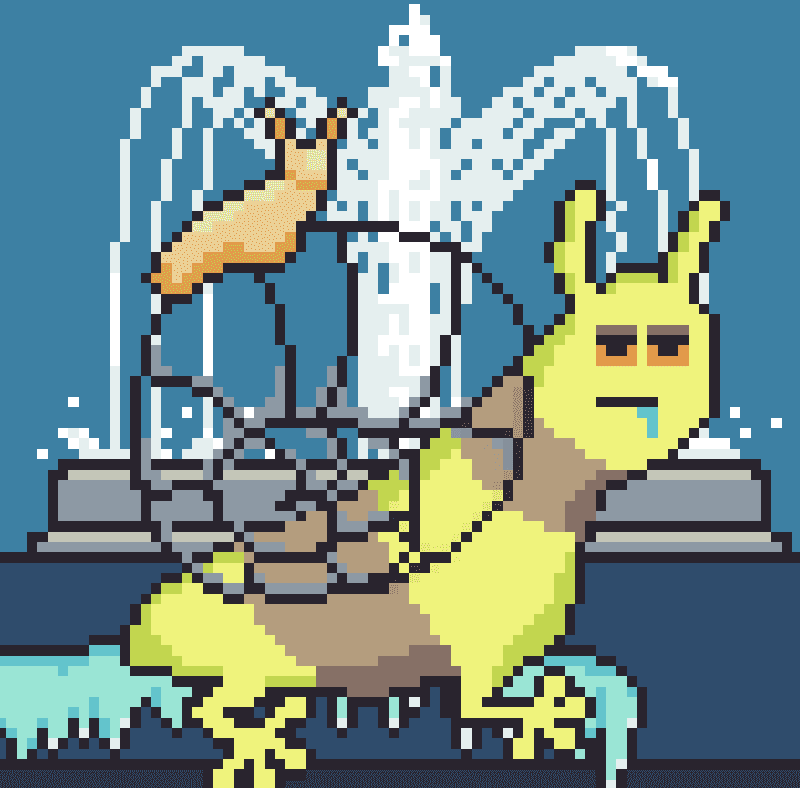

# EvoSnails NFT

GardenScapes Mint 位于：https://www.evosnails.com/ 2000 可用于铸币，每个 0.1 ETH。 在 GardenVerse 中建造、培育、保护、攻击和扩展您的帝国！GardenScapes 官方 Opensea：https://opensea.io/collection/evosnails-gardenscape/目前有超过 4000 只蜗牛被质押。 所有质押的蜗牛都保存在质押钱包中。 这意味着 OpenSea 上的持有者数量并不能反映真实的持有者数量。EvoSnails 是一个完全上链的开源 NFT 项目，允许用户质押他们的蜗牛并升级蜗牛特征。 升级后，蜗牛将在 12 月 3 日角逐奖品。 慢而稳真的能赢得比赛吗？

随着蜗牛在短短几周内不断进化，农民们注意到他们的花园已经开始发生变化。不仅地面开始移动，而且神秘的气息也开始吸引来自以太世界各个角落的当地野生动物。

土地是以太宇宙中所有生物的基地，允许独占进入第 3 阶段及以后。

在您的土地上铸造、建造、培育、保护、攻击和扩张，以获得 EvoSnails 宇宙中最强大的花园。

