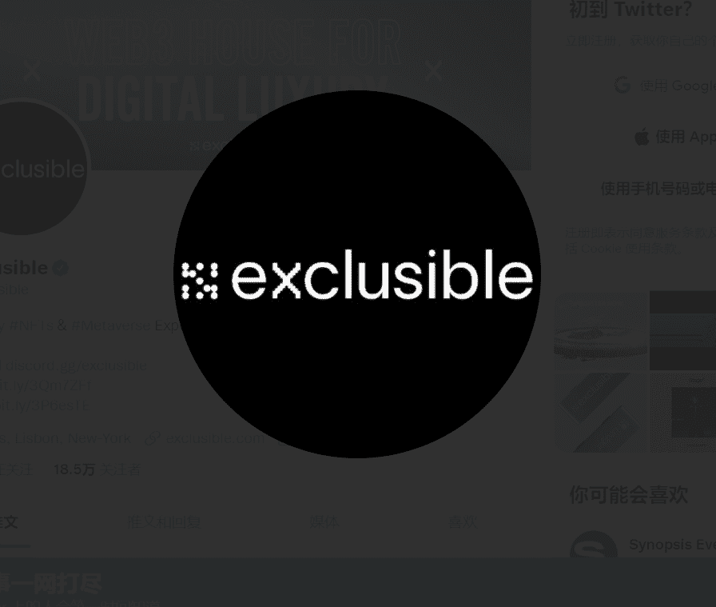

# Exclusible Alpha

在过去 7 天内，排他性 Alpha NFT 被售出 5 次。Exclusible Alpha 的总销售额为 1.06 万美元。一个 Exclusible Alpha NFT 的平均价格为 211.7 美元。有 1,334 名排他性 Alpha 所有者，拥有 3,000 个代币的总供应量。

关于阿尔法收藏：

Alpha NFT drop 是 Exclusible 有史以来的第一个系列，代表了进入最受欢迎的数字奢侈品俱乐部的一张入场卡。数量有限的 3000 个单位，未来有许多好处和实用程序；它是通往大型奢侈品牌和国际名人最迷人的 NFT 掉落、元界和游戏体验的通行证。

关于 Exclusible：Exclusible 是一个高级策划的虚拟平台，为世界上最令人向往的奢侈品牌和主要名人提供限量版 NFT 和高端元宇宙体验。在 exclusible.com 上了解有关 Exclusible 的更多信息

