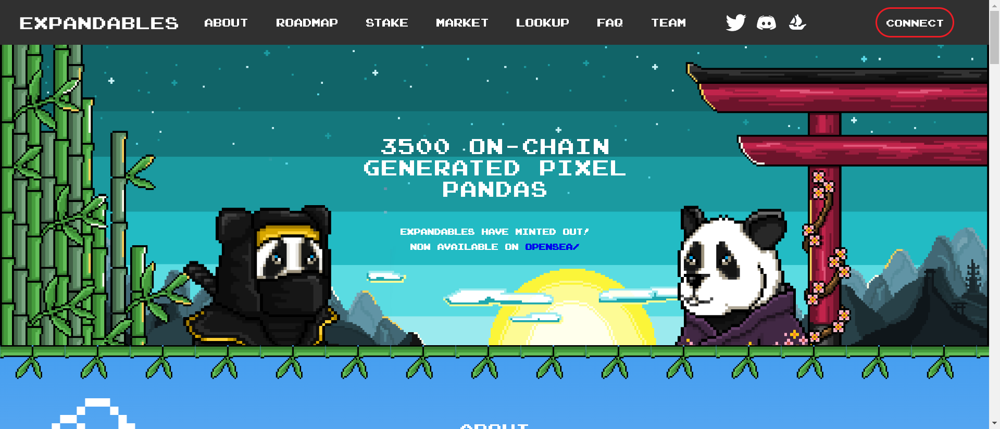

# Expandables Official

由于大量的熊猫被质押，持有人的数量不正确！

Expandables 是一系列使用 Chainlink VRF 生成的 3,500 个可爱的链上像素熊猫。

使用我们的 ERC-20 代币 $BAMBOO 和即将推出的 Panda Voxels，采用并冒险进入元界！

我们的项目围绕着成为 Metaverse 的一部分并将大量熊猫引入新栖息地的激动人心的体验为中心。

收养熊猫不仅意味着您可以在元宇宙中炫耀您的体素，您还将帮助我们对抗现实生活中这个美丽物种的濒危！

