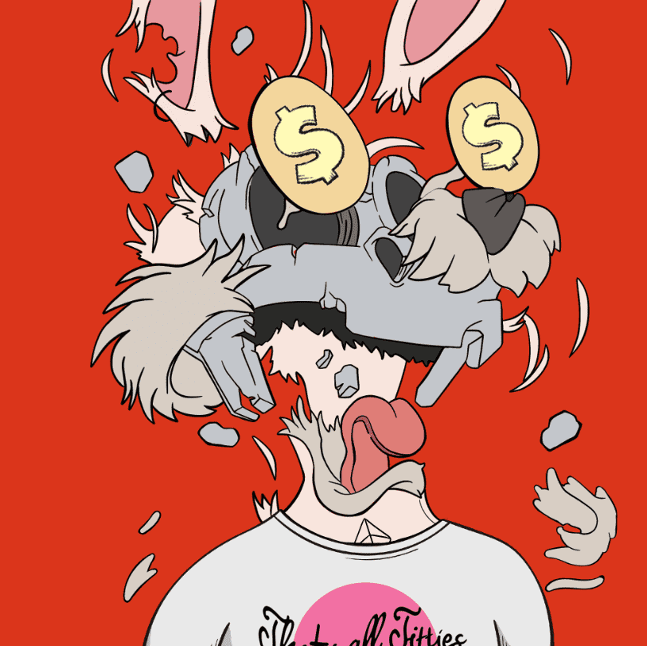

# ExplodedDegen

ExplodedDegen NFT 在过去 7 天内售出 2624 次。ExplodedDegen 的总销售额为 33.24 万美元。一个 ExplodedDegen NFT 的平均价格为 12.7 美元。有 2,112 名 ExplodedDegen 所有者，总共拥有 4,444 个代币。

4,444 你的Toonz 爆炸版！

ExplodedDegen NFT - 常见问题（FAQ）
▶ 什么是 ExplodedDegen？
ExplodedDegen 是一个 NFT（Non-fungible token）集合。存储在区块链上的数字艺术品集合。
▶ ExplodedDegen 代币有多少？
总共有 4,444 个 ExplodedDegen NFT。目前，2,112 名所有者的钱包中至少有一个 ExplodedDegen NTF。
▶ ExplodedDegen 最昂贵的销售是什么？
最昂贵的 ExplodedDegen NFT 是 Exploded Degen #130。它于 2022-07-04（2 个月前）以 329.3 美元的价格售出。
▶ ExplodedDegen 最近卖出了多少？
过去 30 天内共售出 2,624 个 ExplodedDegen NFT。
▶ ExplodedDegen 的成本是多少？
在过去 30 天里，ExplodedDegen NFT 最便宜的销售额低于 3 美元，最高销售额超过 22 美元。过去 30 天内，ExplodedDegen NFT 的中位价格为 11 美元。
▶ 流行的 ExplodedDegen 替代品有哪些？
许多拥有 ExplodedDegen NFT 的用户还拥有 Cronies Official、 Meka Rhinos、 XOXO By Maya & Yehuda Devir和 DopeApeClub。

